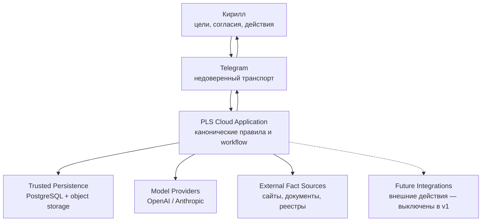
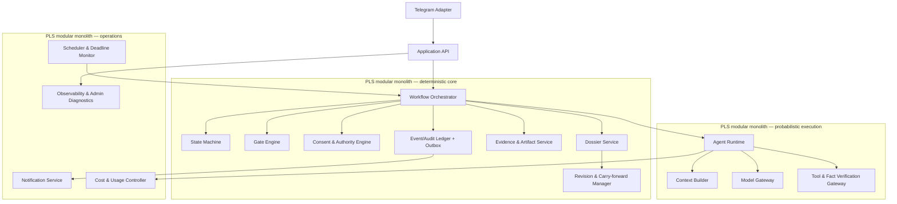
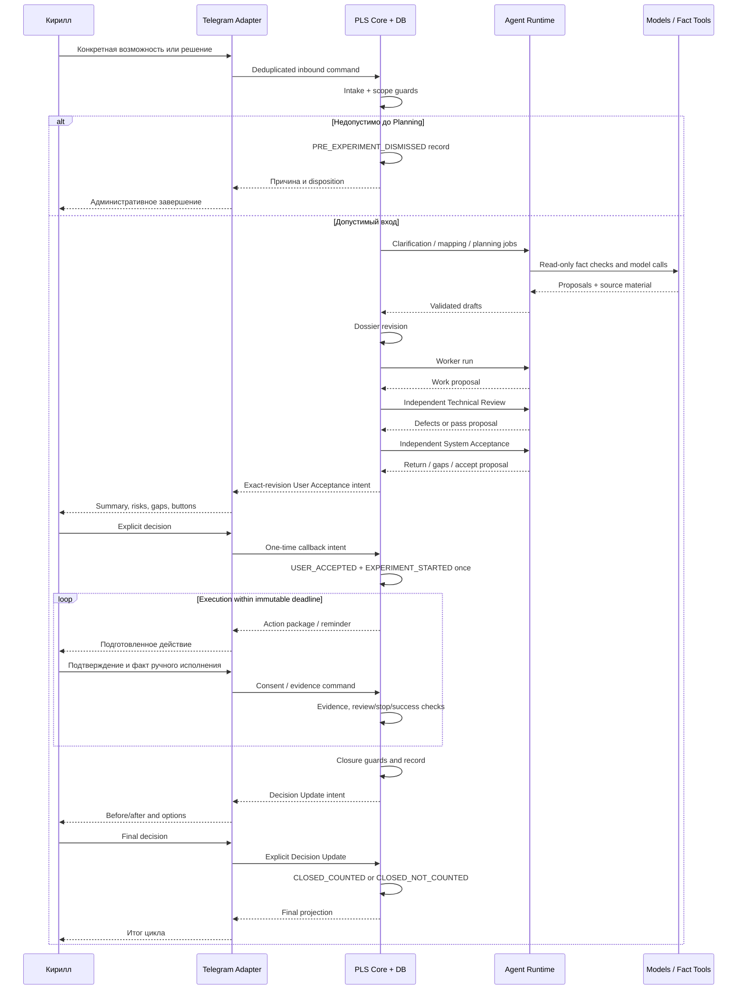
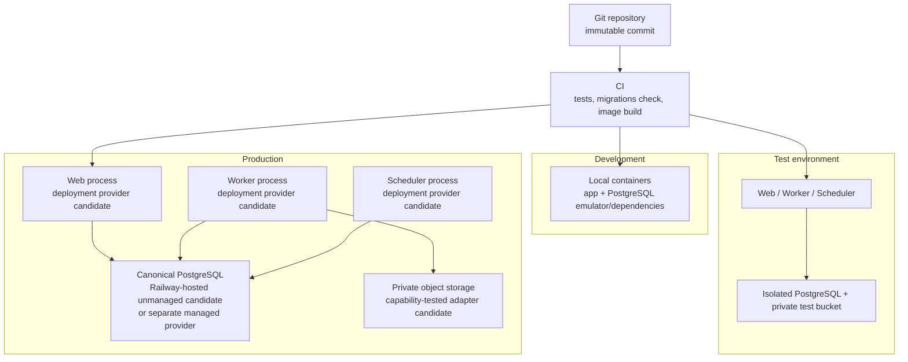

# Personal Leverage System
## Technical Architecture v1.1: архитектура пилотной версии

**Статус:** кандидат на пользовательскую приёмку  
**Дата:** 6 августа 2026 (редакция v1.1; исходная редакция v1 — 2 августа 2026)  
**Заказчик и первый пользователь:** Кирилл  
**Основание:** принятый продуктовый baseline v2 (`01-vision-v2.md`–`05-gates-v2.md`, `10-decisions-log-v2.md`), акт `09-product-baseline-acceptance-v0.md`, аудиторские доказательства `07-audit-resolution-v0.md` и `08-audit-closure-verification-v0.md` с вердиктом `PASS`, независимый архитектурный аудит `12-independent-architecture-audit-v0.md` с вердиктом `PASS WITH REQUIRED CORRECTIONS` и решения Кирилла от 6 августа 2026 по его разделу 16  
**Область:** техническая архитектура минимальной, но целостной пилотной версии PLS  
**За рамками:** программный код, JSON Schema, endpoint-level API, системные промпты, task breakdown и изменение продуктовых решений `PLS-001–PLS-066`

---

## 0. Нормативный статус и терминология

Этот документ не заменяет продуктовый baseline и не создаёт новых `PLS-ID`. Он определяет технические механизмы, которыми реализация должна обеспечивать уже принятые правила. При расхождении архитектурного текста с baseline действует baseline; расхождение является архитектурным дефектом, а не молчаливым изменением продукта.

Используются разные понятия:

| Понятие | Значение в этой архитектуре |
|---|---|
| Продуктовая стадия | Логический участок workflow с входом, обязанностями и результатом |
| Продуктовая роль | Носитель определённой ответственности и границ полномочий |
| Gate Attempt | Одна попытка конкретного гейта над точной неизменяемой редакцией; не считается завершённой, пока не созданы ровно один итоговый Gate Proposal и один Gate Record. Технически blocked session остаётся тем же открытым attempt и не может дать `PASS` |
| Gate Review Session | Технический контейнер полной проверки внутри одного Gate Attempt; не является продуктовой стадией, гейтом, ролью или правом делегирования |
| Agent Run | Одна технически зарегистрированная попытка исполнения одной роли и одного purpose; для Reviewer/System Acceptor охватывает их собственную Gate Review Session |
| Model Call | Один независимый запрос к модельному провайдеру; один Agent Run может содержать несколько ограниченных calls одной роли и purpose |
| Format repair | Дополнительный вызов, исправляющий только машинный формат уже полученного семантического результата; не добавляет проверку, не меняет findings и не создаёт Gate Record |
| Содержательный повтор | Новая проверка после новой редакции или новых значимых evidence; это новый Gate Attempt, новая Gate Review Session и новый Agent Run, а не format repair |
| Программный модуль | Часть кодовой базы модульного монолита с явным интерфейсом |
| Runtime-процесс | Запущенный экземпляр приложения с определённым типом работы |
| Отдельный сервис | Независимо развёртываемая система с собственным операционным контуром |

Стадия не порождает автоматически отдельного агента, модельный вызов, процесс или сервис. Один модуль может обеспечивать несколько стадий; одна роль может выполняться несколькими последовательными Agent Runs; один runtime-процесс может исполнять разные роли, сохраняя разделение контекстов и полномочий.

ChatGPT, Claude как пользовательское приложение и Codex могут использоваться при разработке системы, но находятся вне runtime-архитектуры PLS. Они не являются продуктовыми ролями, не получают runtime-полномочий и не определяют, какие OpenAI/Anthropic models вызываются работающим Model Gateway.

## 1. Архитектурный вывод

### 1.1. Рекомендуемое решение

Для пилота рекомендуется **транзакционный модульный монолит с тремя типами runtime-процессов из одной кодовой базы и одного контейнерного образа**:

1. **Web process** принимает Telegram webhook и служебные health/readiness-запросы.
2. **Worker process** исполняет долговременные внутренние задания, Agent Runs, модельные вызовы и проверку фактов.
3. **Scheduler process** поднимает наступившие Timer, контролирует deadlines и ставит долговременные задания в очередь.

Все процессы используют:

- одну каноническую PostgreSQL-базу;
- один append-only Event/Audit Ledger;
- один private object storage, прошедший минимальный Storage Capability Contract; `S3-compatible` означает только проверенный поднабор операций, а не полную взаимозаменяемость;
- общий детерминированный State Machine, Gate Engine и Consent/Authority Engine;
- общий Model Gateway с независимыми адаптерами OpenAI и Anthropic.

Это не микросервисная архитектура: процессы развёртываются раздельно только из-за различного жизненного цикла и безопасного восстановления, но принадлежат одному приложению, одной модели данных и одному релизному артефакту. Конкретные deployment-, database- и object-storage providers остаются кандидатами до отдельной проверки оплаты, фактической доступности и data policy.

### 1.2. Почему решение соответствует пилоту

- Один пользователь и один активный эксперимент не оправдывают сетевое разбиение доменов.
- Одна транзакционная база позволяет атомарно записывать событие, переход, подтверждение, outbox и новую версию без распределённых транзакций.
- Отдельный Worker не задерживает webhook на время LLM-вызовов.
- Отдельный Scheduler переживает перезапуски, но не становится источником времени: timestamps и Timer хранятся в базе.
- Провайдеры моделей и object storage заменяемы через проверяемые capability adapters, но совместимость не предполагается сверх явно протестированного контракта.
- Архитектура допускает будущий вынос модулей, но не оплачивает сложность гипотетического масштаба до двух `CLOSED_COUNTED` циклов.

### 1.3. Сознательно не включается в v1

- автоматический поиск и ранжирование возможностей;
- несколько пользователей и несколько активных экспериментов;
- микросервисы, Kubernetes, service mesh, Kafka и отдельный Redis;
- автономные цепочки агентов глубже одного уровня;
- автоматическое выполнение сообщений, заявок, платежей, бронирований и иных внешних действий;
- RAG-платформа или векторная база для полного персонального архива;
- автоматическое обучение моделей на кейсах Кирилла;
- визуальная административная панель как отдельный продукт;
- сложная high-availability топология приложения до подтверждения ценности пилота.

В v1 квалифицирующие внешние действия выполняет Кирилл. Система готовит действие, связывает с точной редакцией и подтверждением, а затем фиксирует пользовательскую аттестацию или независимый след. Будущие исполняющие интеграции допускаются только за `External Action Gateway` и требуют отдельного ADR и технической спецификации.

## 2. System Context

### 2.1. Границы доверия и ответственности

| Участник/система | Доверие | Ответственность | Не является источником истины для |
|---|---|---|---|
| Кирилл | Единственный User Acceptor и владелец полномочий | Цели, факты о себе, остаточный риск, расходы, внешние действия, финальные решения | Технического прохождения гейтов и системных guards |
| Telegram | Недоверенный транспорт доставки | Доставка сообщений и callback | Состояния, версий, согласий, Gate Records, evidence |
| PLS Application | Доверенная вычислительная граница | Guards, переходы, версии, permissions, журнал, timers, восстановление | Истинности внешнего мира без evidence |
| Model Providers | Недоверенные вероятностные процессоры | Анализ и структурированные предложения | Нормативного состояния, согласия, прохождения гейта и полномочия |
| External Fact Sources | Недоверенные источники данных | Предоставление внешнего материала | Команд приложению и изменения workflow |
| PostgreSQL/object storage | Доверенная persistence-граница | Канонические записи, история, файлы и контроль целостности | Интерпретации фактов без соответствующих записей |
| Future Integrations | Привилегированная внешняя граница, выключенная в v1 | В будущем — исполнение точно разрешённого действия | Самостоятельного выбора действия, адресата, текста, суммы или данных |

Telegram update, prompt, модельный ответ и содержимое внешнего документа всегда считаются входом, а не командой на нормативное изменение.

## 3. Компонентная архитектура

### 3.1. Модули и их ответственность

| Компонент | Ответственность | Критическая граница |
|---|---|---|
| Telegram Adapter | Проверка webhook secret token, allowlist единственного `telegram_user_id` и private chat, дедупликация `update_id`, нормализация message/callback, отправка через outbox | Forwarded/group/foreign-account input не создаёт решение; transport payload не является полномочием |
| Application API | Единая входная граница команд, корреляция, аутентификация Кирилла, idempotency | Не содержит бизнес-правил переходов |
| Workflow Orchestrator | Маршрутизация команды к модулю, создание заданий, выбор следующего допустимого шага | Не принимает LLM-текст как событие без валидации |
| deterministic State Machine | Текущее состояние, guards, разрешённые переходы, terminal lock, единственный активный эксперимент | Единственный модуль, способный предложить транзакции нормативного перехода |
| Gate Engine | Последовательность TR → SA → UA, Gate Attempts, Gate Review Sessions, Coverage Validator, Gate Records, результаты, счётчики, дефекты, independence checks | Гейт не пройден без полной coverage и неизменяемого Gate Record точной редакции |
| Consent and Authority Engine | Consent, Authority Grant, expense/action scope, срок, отзыв, точная редакция | Молчание, summary и общее согласие не создают полномочие |
| Dossier Service | Каноническое досье, текущая проекция, логические области и ссылки | Одна запись — один источник истины |
| Revision and Carry-forward Manager | Редакции, parent/delta, materiality, snapshots, carry-forward владельца гейта | Любая межгейтовая правка создаёт редакцию; сомнение означает material |
| Agent Runtime | Agent Runs, роль, attempt, зависимости, bounded delegation, сбор структурированного результата | Не имеет права записывать нормативный переход или Consent |
| Context Builder | Минимальный Context Package по роли и задаче, redaction, provenance, budget | Не передаёт полный кейс по умолчанию |
| Model Gateway | Native adapters, stateless-by-default calls, role/case/purpose isolation, dated provider data-policy registry, structured output, retries, usage, semantic normalization | Fail-closed при несовместимой data policy; provider state/tools не дают DB, secrets или authority |
| Tool and Fact Verification Gateway | Явно описанные client-side read-only инструменты, их фактическое исполнение, snapshot факта, источник, дата, доверие | Provider-hosted tools запрещены в v1; внешний материал помечается `UNTRUSTED`; поиск возможностей запрещён |
| Evidence and Artifact Service | Storage Capability Contract, metadata, application-level SHA-256, загрузка/чтение, quarantine, immutable keys, evidence links, backup/export manifest | Наличие текста в prompt не считается evidence; непроверенная S3-функция не вызывается |
| Event/Audit Ledger | Append-only Event, State Transition, causation, actor, version, решения | История не обновляется на месте и не удаляется обычным workflow |
| Transactional Outbox | Намерения уведомления/будущего dispatch в той же транзакции, что событие | Устраняет разрыв «решение записано, сообщение не отправлено» |
| Scheduler and Deadline Monitor | Durable Timer scan, ожидания, 45/60 минут, day 14, retries | Перезапуск не пересчитывает и не переносит timestamps |
| Notification Service | Идемпотентная доставка Telegram-проекций и напоминаний | Повторная доставка не повторяет доменное действие |
| Cost and Usage Controller | Model и infrastructure usage, датированный cost envelope, лимиты по роли/кейсу/среде, предупреждения и остановка | Billing limit провайдера не является разрешением продуктового или инфраструктурного расхода |
| Observability/Admin Diagnostics | Трассировка, метрики, read-only диагностика, replay-проверка | Ручная диагностика не редактирует канон; исправление — новая команда/событие |

### 3.2. Физическая упаковка

Все перечисленные компоненты — модули одного приложения. Отдельными развёртываемыми процессами являются только `web`, `worker`, `scheduler`. PostgreSQL, object storage, Telegram и модельные провайдеры — внешние инфраструктурные зависимости. Notification Service исполняется Worker-процессом; отдельный сервис для него не нужен.

## 4. Детерминированное и вероятностное: матрица полномочий

| Область | Детерминированный код | Что может предложить LLM | Что решает Кирилл | Запрещено автоматизировать в v1 |
|---|---|---|---|---|
| Scope/Intake | Проверяет обязательные поля, допустимый домен и маршрут `G27` | Классификацию, уточняющие вопросы, обоснование | Подтверждает существенную переформулировку или прекращение по своему выбору | Автопоиск новой возможности |
| State transition | Проверяет current state, event type, guards, version и terminal lock; пишет переход транзакционно | Только `Transition Proposal` с основаниями | Даёт требуемое продуктом решение | Прямая запись состояния моделью |
| Gates | Проверяет порядок, revision hash, вход, independence, допустимый результат, открытые defects/gaps; создаёт Gate Record | Reviewer/Acceptor proposal, defects, gaps, rationale | Только User Acceptance и разрешённые компромиссы | Считать гейт пройденным по тексту модели |
| Materiality | Применяет закрытые технические правила и презумпцию material при сомнении | Выявляет delta и вероятное влияние | Подтверждает свою UA carry-forward в допустимых границах | Молчаливый перенос гейта |
| Expense | Сверяет сумму, валюту, назначение, revision, action, риск, срок и одноразовый intent | Оценку стоимости/риска | Разрешает каждый расход отдельно | Оплата или пакетное денежное полномочие |
| External action | Проверяет Action Contract и Authority Grant; в v1 только регистрирует | Черновик, адресата, данные, риск, evidence plan | Разрешает и вручную выполняет действие | Автоматическая отправка/заявка/звонок/платёж |
| Fact conclusion | Сохраняет источник, retrieval time, snapshot/hash, freshness и тип сведения | Поиск в разрешённой области, анализ и классификацию | Подтверждает личные факты и спорные трактовки | Представлять непроверенное как факт |
| Time/deadlines | Считает объединение интервалов, 45/60 минут, immutable start, day 14 и overdue timers | Оценку оставшейся работы | Даёт конкретное дополнительное время или выбирает иной путь | Сброс времени новой редакцией/паузой |
| Closure | Проверяет `G16`, обязательства, evidence, расходы и допустимый маршрут | Draft Closure и альтернативные интерпретации | Подтверждает личные факты/обязательства | Закрыть кейс только потому, что LLM написала `closed` |
| Decision Update | Проверяет обязательные поля, explicit decision, `G17/G18/G23/G24` | Сравнение baseline, варианты решения, draft recommendation | Принимает финальное решение, оценки и следующий шаг | Создавать пользовательское решение или пилотный зачёт |
| Linked Case | Создаёт новый identity, новый counter и отсутствие наследования authority | Предлагает связь и новый вопрос | Передаёт новый вопрос в систему | Автоматически наследовать consent, grants или gates |
| Late Evidence | Регистрирует новую запись без смены terminal state | Анализирует влияние как справку | Решает, создавать ли новый кейс | Переоткрывать или пересчитывать терминальный кейс |

В v1 LLM выполняет только read/analysis/draft-функции. Все команды, которые могут изменить нормативное состояние, представлены типизированным application command и исполняются только после серверной валидации. Текстовое поле модели никогда не используется как SQL/state value без allowlist и проверки.

## 5. Исполнение агентных ролей

### 5.1. Общий контракт Agent Run

Каждый Agent Run имеет: `case_id`, `role`, `purpose`, `attempt`, `context_package_id`, `input_revision_id`, разрешённые tools, budget, deadline, parent run, producer run IDs, status, result artifact, validation result и cost records. `purpose` неизменяем и допускает только одну сторону разделения: **production** либо **verification**.

Model Call является дочерней записью Agent Run. Один Model Call не может быть связан одновременно с production- и verification-run. Каждый фактический provider request, включая timeout retry, является отдельным Model Call с собственным идентификатором; максимум один его результат может быть применён. Результат сначала сохраняется как неконанонический proposal или immutable intermediate finding, затем проходит синтаксическую, контрактную и доменную валидацию.

### 5.2. Роли, контекст и ограничения

| Роль | Обязательная форма исполнения в пилоте | Отдельный Model Call | Независимый Context Package | Детерминированный механизм |
|---|---|---|---|---|
| Orchestrator | Прежде всего программная маршрутизация | Не обязателен; если нужен анализ/классификация, это отдельный proposal-call | Да для любого optional call | Workflow Orchestrator + State Machine принимают шаг |
| Planner | Вероятностное построение плана | Да, отдельный production-call/run | Да, planning package | Validator принимает только структурированный Plan Proposal |
| Worker | Вероятностное создание chunk/work product | Да, отдельный production-call на chunk | Да, chunk package | Merge validator и Revision Manager решают, создавать ли revision |
| Technical Reviewer | Независимая проверка exact revision | Да: отдельный verification-run и одна Gate Review Session с несколькими bounded calls по Coverage Plan | Да, review package из канона | Coverage Validator и Gate Engine вычисляют допустимый result и пишут один record |
| System Acceptor | Независимая системная приёмка после TR | Да: новый verification-run и собственная Gate Review Session, отличная от Reviewer | Да, acceptance package | Coverage Validator и Gate Engine проверяют gaps, порядок, связи и exact revision |
| User Acceptor | Человеческое решение Кирилла | Нет | Decision summary + доступ к полной revision | Consent/Authority Engine валидирует exact Decision Intent |

Model Call Planner/Worker никогда не переиспользуется как Reviewer/System Acceptor call. Reviewer и System Acceptor также не являются двумя секциями одного ответа: это разные runs, разные context packages и разные Gate Proposals.

| Роль | Ответственность | Входной Context Package | Инструменты | Результат | Лимит контекста пилота | Субагент | Кто проверяет | Не вправе |
|---|---|---|---|---|---|---|---|---|
| Orchestrator | Определить следующий технический шаг, запросить недостающее, запланировать run | Текущее состояние, pending command, guard facts, pending decisions, минимальная история | Только внутреннее read; без внешних writes | `Orchestration Proposal`/job plan | До 4k нормализованных входных токенов; сверх — ссылки, не полный текст | Нет; глубина 0 | State Machine и Workflow Orchestrator | Менять state, выдавать consent, принимать гейт |
| Planner | Построить один исполнимый эксперимент и декомпозицию | Decision Core, карта фактов/неизвестных, лимиты, policies, актуальные evidence refs | Read-only Fact Gateway, расчёты | `Plan Proposal`, chunk manifest, evidence plan | До 12k; обязательный резерв не менее 25% окна на вывод/ошибки | Нет; глубина 0 | Dossier validator, затем Worker/TR | Запускать действие, менять criteria после Execution |
| Worker | Создать/исправить конкретный chunk досье или артефакт | Только Chunk Package: цель, relevant records, dependencies, budget, acceptance criteria, prohibitions | Read-only facts, безопасные расчёты, draft artifact tools | `Chunk Result` с provenance, assumptions, unresolved items | До 16k на chunk; Context Builder обязан сократить, а не молча переполнить | Да, только при независимой декомпозируемой подзадаче; максимум 2 дочерних run, глубина 1 | Merge validator и Technical Reviewer | Самопринимать, писать канон, делегировать полный кейс |
| Technical Reviewer | Найти технические, доказательные, безопасностные и исполнимостные дефекты точной редакции | Независимый Review Package: immutable revision, deterministic Coverage Plan/Matrix, criteria, evidence refs, policy snapshot; worker rationale не заменяет объект проверки | Только client-side read-only dossier/evidence/fact re-check через Gateway | Один итоговый `Technical Review Proposal` с единым полным defect list | До 20k на один Model Call, не на всю session; большая revision проверяется всеми запланированными passes | Нет; глубина 0; несколько calls внутри session не являются субподрядом | Coverage Validator и Gate Engine; System Acceptor не переписывает TR findings | Исправлять работу, принимать свой output, передавать проверку Worker/producer, разрешать gap Кириллом |
| System Acceptor | Проверить целостность продукта, scope, gaps, полномочия и готовность к осознанному UA | Independent Acceptance Package: exact revision, passed TR record, собственные Coverage Plan/Matrix, requirements, gaps, summaries и evidence refs | Только client-side read-only | Один итоговый `System Acceptance Proposal` с единым списком gaps/defects | До 20k на один Model Call; session покрывает все области и обязательные связи | Нет; глубина 0 | Coverage Validator и Gate Engine; затем Кирилл | Подменять TR, использовать TR session/state, принимать запрещённый gap, создавать UA |
| User Acceptor | Принять/вернуть/отложить/отклонить точную редакцию и отдельные риски | Telegram decision summary + доступ к полной exact revision + explicit gaps/actions/expenses | Кнопки decision intent; просмотр полного dossier | Consent/Gate decision Кирилла | Не модельный контекст; summary ограничен читаемостью, полный пакет доступен по ссылке/частям | Нет | Consent & Authority Engine | Принимать технический дефект, общим согласием разрешать расходы |

Числа лимитов — эксплуатационные настройки пилота, а не продуктовые правила и не обещание достаточности. Model Gateway считает нормализованный объём до вызова; если пакет не помещается, Context Builder создаёт manifest и последовательность проверяемых chunks либо останавливает run с `CONTEXT_BUDGET_EXCEEDED`. Для гейтов недостаток разрешённого числа calls или стоимости даёт `BLOCKED_COVERAGE_OR_BUDGET`, никогда не `PASS`: Coverage Plan нельзя сокращать ради лимита. Усечение обязательного содержания без записи запрещено.

### 5.3. Механизм chunks

1. Planner создаёт `Chunk Manifest`: цель, входные canonical references, зависимости, критерии результата и ожидаемый evidence/provenance.
2. Context Builder формирует `Chunk Package` только из необходимых записей; персональный контекст включается по allowlist полей.
3. Worker возвращает draft с `input_hashes`, assumptions, outputs, unresolved items и предложенными canonical links.
4. Результат хранится как draft artifact и не становится частью текущего досье.
5. Merge validator проверяет зависимости, stale inputs, обязательные поля, конфликты и provenance.
6. Revision Manager создаёт новую целостную Dossier Revision; если затронута межгейтовая версия, применяются materiality/carry-forward rules.
7. Reviewer получает revision snapshot, а не историю разговоров Worker с субагентами.

Субагенту передаются только: псевдонимный `case_id`, цель подзадачи, минимальные факты/evidence refs, budget, acceptance criteria, запреты, срок и parent run. Consent, секреты, нерелевантная личная история, полный dossier и полномочия не передаются. Его результат — неконанонический proposal; автоматическое слияние запрещено.

### 5.4. Gate Review Session для большой редакции

Gate Review Session — техническая конструкция внутри одного Gate Attempt. Она не добавляет стадию, роль или гейт и не разрешает Reviewer обращаться к Worker как к субподрядчику. Для Technical Reviewer и System Acceptor создаются разные sessions, Agent Runs, Context Packages, findings и synthesis calls.

Сессия неизменно привязана к `gate_attempt_id`, роли, `case_id`, exact immutable `revision_id`, content hash, criteria/policy versions и своему purpose `verification`. После старта revision заменить нельзя; новая материальная редакция означает новый Gate Attempt.

Детерминированный Coverage Plan строится до первого Model Call из manifest редакции и нормативного реестра областей. Он содержит стабильные IDs всех 27 областей: (1) паспорт; (2) исходное обращение; (3) вопрос/цель/ставка/scope; (4) альтернативы/приоритеты; (5) baseline решения; (6) baseline обычного способа; (7) карта знаний/происхождения; (8) источники/актуальность; (9) решающее неизвестное; (10) рекомендация/альтернативные интерпретации; (11) контракт эксперимента; (12) success/review/stop; (13) контракты внешних действий; (14) подтверждения/полномочия; (15) ресурсы/лимиты/сроки; (16) риски/безопасность/данные; (17) раскрытые пробелы; (18) Execution Pack; (19) история редакций/гейтов; (20) Execution Log; (21) Evidence Register; (22) Review/Stop Records/ожидания; (23) Closure; (24) Decision Update; (25) сравнение до/после; (26) итоговый статус/зачёт; (27) linked cases/late evidence. Для области, ещё не применимой на текущей стадии, требуется проверенный результат `NOT_YET_APPLICABLE` с нормативным основанием; пустая ячейка запрещена.

Coverage Plan также содержит отдельный реестр cross-area invariants и конкретные направленные связи, как минимум:

- identity/scope/alternatives ↔ оба baseline ↔ recommendation;
- provenance/freshness ↔ decisive unknown ↔ recommendation;
- unknown ↔ experiment contract ↔ conditions ↔ external actions ↔ evidence ↔ Decision Update;
- actions ↔ consent/authority ↔ expense ↔ data disclosure ↔ risk ↔ Execution Pack/Log;
- limits/time ↔ timers ↔ immutable start/day 14 ↔ review/stop/Closure;
- revision delta ↔ materiality ↔ three gates/carry-forward ↔ disclosed gaps;
- Execution Log ↔ Evidence Register ↔ Closure ↔ before/after ↔ final status/countability;
- linked case/late evidence ↔ terminal lock ↔ запрет наследования grants/gates/counter.

Каждая обязательная область и каждая связь назначаются хотя бы одному bounded verification pass. Coverage Matrix имеет для каждого элемента: assigned pass, input hashes, проверяемый критерий, outcome `CHECKED_OK/FINDING/NOT_APPLICABLE/INCONCLUSIVE`, finding IDs и validation status. Один call может проверять несколько областей, если весь его Context Package помещается в лимит; одна крупная область может быть разбита на несколько calls, но manifest обязан доказать полноту её частей.

Порядок сессии:

1. Зафиксировать exact revision и детерминированно построить Coverage Plan/Matrix.
2. Выполнить один или несколько ограниченных verification Model Calls. Каждый получает только назначенные области, необходимые соседние records, конкретные cross-area edges, criteria и запреты роли.
3. После каждого прохода сохранить immutable intermediate findings, `no finding` outcomes, input/result hashes и provenance. Поздний call не переписывает прежнее finding; исправление классификации создаёт связанную запись.
4. Выполнить финальный synthesis call, который получает manifest, результаты **всех** passes, единый список findings и полностью заполненную cross-area matrix. Synthesis не получает право скрывать finding: он дедуплицирует, связывает и формирует один полный defect/gap list.
5. Детерминированный Coverage Validator проверяет: все 27 areas имеют допустимый outcome; все обязательные edges проверены; все planned passes завершены; все findings представлены synthesis; hashes и revision совпадают; нет незаполненных или конфликтующих ячеек.
6. Только после validator `COMPLETE` Gate Engine принимает ровно один итоговый Gate Proposal и атомарно пишет ровно один Gate Record для Gate Attempt. `PASS/ACCEPTED` запрещён при `INCONCLUSIVE`, пропуске области/связи, незавершённом pass, неполном synthesis или несовпадении revision.

Format repair остаётся внутри того же Agent Run/Session и может исправить только сериализацию уже зафиксированного семантического результата. Provider timeout retry — новый Model Call той же session с тем же назначением; оба ответа сохраняются, применяется максимум один. Содержательный повтор после новой revision/evidence — новый Gate Attempt, новая session и новый Gate Record. При исчерпании call/cost limit session приостанавливается с сохранённой Coverage Matrix; после отдельного разрешения бюджета продолжаются только незавершённые planned passes, но `PASS` до полной coverage невозможен.

## 6. Независимость проверок

### 6.1. Технические барьеры

| Инвариант | Механизм |
|---|---|
| Worker отделён от Technical Reviewer | Разные Agent Run с разным `purpose`; reviewer run не может иметь producer run среди ancestors; provider session/thread identifiers не наследуются; context строится заново из canonical revision snapshot |
| Reviewer отделён от System Acceptor | System Acceptor получает неизменяемый Gate Record Reviewer, но создаёт собственные Gate Attempt/Session/run/context/provider calls; он не получает provider-side state Reviewer и не обновляет ранний record |
| Самоприёмка невозможна | Gate Engine отклоняет Gate Proposal, если `actor_run_id` совпадает с producer/merger run, role/session не соответствует gate либо purpose не `verification` |
| Проверяется точный объект | Gate Record содержит `case_id`, `revision_id`, content hash, criteria version и context package hash |
| Независимый контекст | Review/Acceptance Package собирается из канонических записей; conversation/thread/session IDs производителя и другой проверочной роли запрещены; непроверенные рассуждения Worker не считаются evidence |
| Полнота большой проверки | Отдельные role-specific Gate Review Sessions, Coverage Plans/Matrices, immutable findings, synthesis и deterministic Coverage Validator по §5.4 |
| История возвратов сохраняется | Каждый return создаёт новый неизменяемый Gate Record, Defect records и causation links; исправление закрывает defect новой записью |
| Пожизненный TR-counter | Считается запросом по всем Gate Records `TECH_REVIEW_RETURNED` одного `case_id`; current projection является кэшем и сверяется с ledger |
| Повторные гейты после material edit | Revision Manager аннулирует применимость затронутых grants/gates, State Machine переводит в `REVALIDATION_REQUIRED`, Gate Engine требует TR → SA → UA для target revision |
| User Acceptance только от Кирилла | User identity сверяется с единственным configured Telegram user id; решение создаётся из серверного one-time Decision Intent |

Один и тот же provider/model может обслужить Worker и Reviewer только разными stateless-by-default вызовами без общего provider identifier или server-side memory. Это обеспечивает процессную независимость, но не исключает коррелированную модельную ошибку. Для повышенной глубины допускается routing Reviewer к другому провайдеру; failover всегда начинает независимый call из canonical Context Package, а не продолжает скрытое состояние. Требовать другой provider для всех пилотных кейсов нецелесообразно до измерения стоимости и качества.

### 6.2. Gate Record и carry-forward

Gate Record неизменяем. Новый record может ссылаться на прежний как `supersedes applicability`, но не редактирует его. Carry-forward создаётся только владельцем соответствующего гейта и содержит source revision, target revision, полный delta, materiality evidence, scope переноса и исключения. Gate Engine программно запрещает перенос, если изменились действие, адресат, внешний текст, расход, данные, риск, gap, срок, нагрузка, полномочие или человечески воспринимаемый смысл. При неоднозначности возвращается `REVALIDATION_REQUIRED`.

User Acceptance carry-forward создаётся только callback/явной командой Кирилла. Model output может подготовить объяснение delta, но не создать перенос.

## 7. Сквозной runtime-процесс

### 7.1. Нормативная последовательность исполнения

1. Telegram Adapter принимает update, проверяет источник и дедуплицирует его.
2. Application API создаёт Inbound Command; State Machine либо создаёт/продолжает кейс, либо фиксирует `PRE_EXPERIMENT_DISMISSED` до Planning.
3. Clarification и Fact Mapping получают только необходимые ответы; ожидание Кирилла закрывает активный preparation interval.
4. Fact Gateway сохраняет Fact Records и snapshots; LLM-анализ остаётся proposal.
5. Planner и Worker формируют candidate dossier; Revision Manager создаёт целостную редакцию.
6. Technical Reviewer выполняет отдельный run. Return создаёт Gate Record и пожизненный counter; pass разрешает System Acceptance.
7. System Acceptor выполняет отдельный run. Допустимые gaps регистрируются; запрещённый gap возвращает работу.
8. Gate Engine создаёт exact-revision User Acceptance Intent и summary.
9. Только валидное решение Кирилла создаёт User Gate Record. Первый `USER_ACCEPTED`, допускающий Execution, атомарно создаёт `EXPERIMENT_STARTED`.
10. В v1 Кирилл вручную выполняет внешние действия. Consent/Authority records, Execution Log и Evidence записываются отдельно.
11. Success/review/stop/deadline события обрабатываются State Machine. Material change возвращает затронутые действия на три гейта; неизменённое возобновление использует `RESUMPTION_ONLY`.
12. Evidence Collection формирует проверяемый реестр. Closure создаётся только при выполненных guards и отсутствии незакрытых обязательств.
13. Decision Update требует явного решения Кирилла и только после него допускает `CLOSED_COUNTED`/`CLOSED_NOT_COUNTED`.
14. Terminal lock запрещает переоткрытие; late evidence добавляется отдельной записью.

## 8. Telegram UX и подтверждения

### 8.1. Аутентификация транспорта

До парсинга update Web process в constant-time сравнивает заголовок `X-Telegram-Bot-Api-Secret-Token` с активным webhook secret из secret store. Отсутствующий/неверный token отклоняется без регистрации доменной команды. После этого Telegram Adapter применяет allowlist: единственный настроенный `from.id == telegram_user_id` Кирилла, единственный допустимый private `chat.id` и `chat.type == private`. Group/supergroup/channel, anonymous/business sender, другой account и callback без допустимого `from.id` не создают Inbound Command, Decision Intent outcome или Consent; фиксируется минимальное security event без содержимого.

Forwarded/copy-origin metadata не может быть доказательством авторства решения. Forwarded message допускается только как недоверенный материал для анализа после явного ввода Кирилла в допустимом private chat; его текст никогда не сопоставляется с «да» или иным решением. Для решения требуется callback/явная команда, созданная самим allowlisted account и связанная с серверным Intent.

### 8.2. Типы сообщений

**Информационные сообщения** не содержат решения: статус работы, запрос уточнения, факт приостановки, reminder, отчёт о недоступности провайдера, уведомление о сохранённом событии. Они могут иметь навигационную кнопку «Открыть актуальную версию», но не создают Consent.

**Decision messages** создаются только для нормативных точек:

- `INITIAL`, `REVALIDATED`, `RESUMPTION_ONLY` User Acceptance;
- отдельное действие;
- отдельный расход;
- принятие disclosed gap/остаточной неопределённости;
- дополнительное время после preparation limit;
- review/stop choice;
- Closure obligations, где baseline требует личного подтверждения;
- Decision Update;
- создание нового связанного кейса.

### 8.3. Decision Intent

Кнопка содержит не состояние, сумму или текст решения, а короткий непрозрачный токен серверного `Decision Intent`. Сам Intent хранится вне Telegram и связывает:

- Кирилла и Telegram account;
- `case_id`;
- exact `revision_id` и content hash;
- вид действия/решения;
- action/expense/gap identifiers;
- сумму, валюту и назначение расхода, если применимо;
- риски и данные, показанные пользователю;
- допустимые варианты ответа;
- created/expiry timestamps;
- nonce и idempotency key;
- статус `pending/consumed/expired/superseded`.

Callback обрабатывается транзакционно. Guard повторно проверяет webhook secret, allowlisted account/private chat, current case version, revision hash, неизменность action/expense и отсутствие более нового material delta. Только затем создаются Consent/Authority/Gate records. Callback payload содержит только короткий криптографически случайный opaque reference; персональные данные, сумма, case/revision, scope, решение и полномочие находятся только server-side. В БД хранится hash токена; token имеет TTL, one-time CAS, не пишется в логи и редактируется в traces. Утечка reference сама по себе бесполезна без Telegram identity/chat checks и всех server-side guards.

### 8.4. Защита от устаревания и повторов

| Ситуация | Поведение |
|---|---|
| Повторное нажатие | Возвращается прежний результат Intent; нового Consent/Expense Grant нет |
| Устаревшая редакция | Intent помечается `superseded`; callback даёт no-op и ссылку на актуальный summary |
| Задержанное сообщение | Проверяется expiry и current revision; время доставки Telegram не заменяет server time |
| Потеря соединения после нажатия | Решение уже хранится в БД либо Telegram повторяет callback; idempotency возвращает тот же outcome |
| Telegram message удалено/изменено | Канонические записи не меняются; сообщение можно пересоздать из projection |
| Расход изменён | Старый Intent недействителен; создаётся новый expense request и новое отдельное подтверждение |
| Свободный текст «да» | Не считается подтверждением, если не связан с активным Intent; система просит использовать актуальные кнопки/явную команду |
| Callback из чужого account/group chat | Security no-op; Intent остаётся `pending`, Consent/Grant не создаётся; Кириллу при необходимости отправляется новое безопасное сообщение |

### 8.5. Ротация Telegram secrets

Webhook secret и bot token — разные секреты и ротируются независимо. Безопасная ротация bot token выполняется через transport maintenance mode: прекращается выпуск новых Decision messages; pending outbox сохраняется; старый token отзывается; новый заносится только в secret store; webhook заново устанавливается с новым webhook secret; выполняется authenticated health/update check; затем outbox возобновляется с теми же logical notification IDs. Старый token удаляется из runtime и CI variables, а факт ротации фиксируется без значения секрета. Если целостность callback reference могла быть нарушена, pending Intents переводятся в `superseded` и Кириллу выпускаются новые; канонические решения не откатываются. То же правило supersede и перевыпуска обязательно после любого восстановления production-БД по §15.3.

### 8.6. Что показывается Кириллу

Decision summary всегда показывает case/revision label, предмет решения, действия, ожидаемые evidence, deadlines, оставшееся время/нагрузку, расходы, риски, disclosed gaps, данные для передачи, возможность отмены, открытые обязательства и то, что именно изменилось с прошлой редакции. На 45/60 минутах показывается preparation consumption; во время эксперимента — плановый и абсолютный deadline; pending decisions выделяются отдельным списком.

Вне Telegram хранятся полное досье, snapshots, revisions, Gate Records, Consents, Authority Grants, evidence/artifacts, ledger, timers, Agent Runs, Model Calls, costs, Closure и Decision Update. Telegram хранит только транспортную копию и message identifiers.

## 9. Хранение и источник истины

### 9.1. Логические категории данных

| Категория | Назначение и каноничность | Изменяемость |
|---|---|---|
| Case | Identity, владелец, current state/status, active slot, current revision pointer | Current projection с optimistic version; terminal lock |
| Dossier | Устойчивая identity полного кейсового артефакта | Не удаляется обычным workflow |
| Dossier Revision | Целостный snapshot exact revision, parent, delta, materiality, hash | Неизменяемая после публикации |
| Event | Доменное событие, actor, occurred/recorded time, causation | Append-only |
| State Transition | From/to, event, guards, case version | Append-only; current state обновляется той же транзакцией |
| Gate Record | Gate, mode, exact revision, result, owner/run, defects/gaps | Append-only |
| Defect | Класс, источник, критерий, severity, status history | Исходная запись неизменна; изменения отдельными событиями |
| Consent | Явное решение Кирилла, exact object/revision, shown risks, Intent | Append-only; отзыв новой записью |
| Authority Grant | Scope действия, данные, адресат, срок, лимиты | Не расширяется; consumed/revoked отдельным состоянием/событием |
| External Action | Contract, authority, planned/executed facts, evidence links | План версионируется; факт append-only |
| Expense | Request, exact amount/purpose/risk, authorization, actual fact | Каждое изменение требует нового request/consent |
| Evidence | Provenance, source, captured time, hash, strength, links | Evidence immutable; interpretation versioned separately |
| Artifact | File/draft/render metadata, content hash, storage key, quarantine | Immutable object key; новая версия — новый object |
| Fact Record | Fact/assumption/unknown/recommendation, source, freshness, confidence | Версионируется; прежняя запись сохраняется |
| Timer | Fixed due time, kind, case, status, last claim | Durable; due time не пересчитывается без разрешённого события |
| Context Package | Role-specific manifest, selected refs, redactions, policy/version hash | Immutable; хранится для аудита в минимально допустимом объёме |
| Agent Run | Role, purpose, attempts, parent, context, result, status | Append-only lifecycle events + current operational projection |
| Model Call | Provider/model alias, request contract, usage, response status/hash | Append-only; sensitive payload отдельно по retention policy |
| Cost Record | Tokens, tool calls, provider charge estimate/actual, tariff snapshot date | Append-only |
| Closure | Actions/resources/evidence/obligations/preliminary countability | Immutable после completion; исправление новой revision |
| Decision Update | Before/after, explicit Кирилл decision, scores and next step | Immutable accepted record |
| Late Evidence | Evidence after terminal outcome and link to old case | Append-only; no state/status update |
| Linked Case | Typed relation, old/new question, baseline difference | Связь immutable; grants/gates не наследуются |

### 9.2. Четыре слоя хранения

1. **Каноническое текущее состояние:** Case projection, current dossier pointer, open timers/decisions, active authorities. Оптимизировано для guards.
2. **Неизменяемая история:** Event, State Transition, Gate Record, revisions, consent/authority/defect history, Agent Run/Model Call metadata.
3. **Файлы и доказательства:** content-addressed objects; в БД — metadata, hash, provenance, retention и ссылки.
4. **Производные представления:** Telegram summary, read models, dashboards, cost aggregates. Их можно перестроить; они не дают полномочий.

### 9.3. Версионность, locking и idempotency

- Каждая опубликованная Dossier Revision получает монотонный номер внутри case, parent revision и cryptographic content hash.
- Изменение current projection требует ожидаемого `case_version`. Несовпадение даёт conflict; команда перечитывается и не применяется автоматически к новому смыслу.
- Критические команды дополнительно берут transaction-scoped lock на `case_id`; уникальное ограничение предотвращает два активных эксперимента одного пользователя.
- Каждый вход имеет idempotency key по источнику: Telegram `update_id`, callback Intent, timer firing, Agent Run attempt, outbox message, expense/action intent.
- Event и outbox записываются в одной DB-транзакции; модельные и сетевые вызовы выполняются вне блокирующей транзакции, а их результат применяется отдельной optimistic command.
- State восстанавливается из последнего проверенного snapshot/current projection и append-only событий после него. Recovery job сверяет projection с transitions, revisions и hashes; расхождение блокирует кейс в административном `diagnostic hold`, не создавая продуктовый статус.
- Полное event sourcing не требуется: revisions и канонические records сами являются достаточными immutable sources. Ledger обеспечивает причинность и аудит, а не единственное хранение всех байтов.

### 9.4. Storage Capability Contract пилота

`S3-compatible` не считается гарантией полной взаимозаменяемости. Evidence and Artifact Service зависит только от следующего минимального контракта и не вызывает иные S3-функции:

| Capability | Обязательное поведение пилота |
|---|---|
| `PutObject` | Запись по заранее выделенному immutable object key; запрет overwrite; контроль размера/MIME/metadata |
| `GetObject` | Полное и при необходимости range-чтение с последующей application-level SHA-256 verification |
| `HeadObject` | Проверка existence, size и round-trip обязательных metadata до признания upload завершённым |
| `DeleteObject` | По умолчанию запрещён; разрешается только отдельной retention/deletion procedure с авторизацией, tombstone и проверкой backup policy |
| Presigned `GET/PUT` | Короткоживущая URL только на exact key/operation; private bucket; после `PUT` обязательны `HeadObject` и SHA-256 check |
| Multipart upload | Выключен, пока фактический размер пилотных файлов не докажет необходимость; при включении отдельно тестируются initiate/upload/complete/abort и cleanup незавершённых частей |
| Metadata | Стабильный round-trip content type, size, application hash/reference и минимальных policy tags; provider ETag не заменяет SHA-256 |
| Private bucket | Public access отсутствует; least-privilege credentials разделены по средам; список объектов не служит каноном |
| Backup/export | Датированный DB object manifest управляет экспортом через `GetObject`; копия проверяется по SHA-256 и тестируется восстановлением |

До выбора R2 или другого adapter в test environment выполняются conformance tests **каждой** требуемой capability, включая негативные сценарии overwrite, expired presign, metadata mismatch, ограниченный delete и integrity failure. Результат привязан к provider, region/account configuration, SDK/API behavior и effective test date. Любая unsupported/changed operation блокирует production readiness; обнаруживать её впервые в production case запрещено. Функция вне контракта требует расширения контракта и нового conformance proof, а не оптимистичного вызова.

## 10. Время и deadlines

### 10.1. Единый preparation budget

Для каждого case до первого User Acceptance ведётся набор `Preparation Work Interval` с UTC timestamps, job/run id, stage bucket и lease heartbeats. Активное время равно длине объединения всех пересекающихся интервалов, а не сумме длительностей jobs. Если три agents работают параллельно десять минут, бюджет уменьшается на десять минут.

Интервал открывается при начале активной системной работы и закрывается при завершении либо переходе в ожидание Кирилла/внешней стороны. Model Call, fact check, Gate Record и Telegram-summary входят в активный интервал. При падении процесса lease считается активным до последнего безопасно подтверждённого heartbeat/истечения короткого lease; reconciliation выбирает консервативный учёт, не позволяющий недосчитать время.

Stage buckets фиксируются отдельно без жёстких подлимитов. Пока пакет ещё не предъявлен на первый User Acceptance, новая revision, внутренний return, pause, повторный gate и Cycle Review продолжают тот же preparation ledger. После первого предъявления последующая работа учитывается отдельно и не переписывает исходный 60-минутный показатель. Дополнительное время является количественным grant, добавляющим лимит, но не обнуляющим consumed time.

### 10.2. 45 и 60 минут

- При первом достижении 45 минут атомарно создаётся один `PREPARATION_BUDGET_CHECK` с idempotency key, привязанным к case и исходному preparation budget. Scheduler ставит задачу показать прогноз, убрать необязательные улучшения и предложить допустимое сужение без обхода гейтов.
- На 60 минутах (либо на границе явно добавленного tranche) `PREPARATION_LIMIT_REACHED` блокирует создание новых preparation jobs и применение поздних model results. Уже идущие вызовы кооперативно отменяются; вернувшийся результат сохраняется как late draft, но не применяется без нового решения Кирилла.
- Кириллу показываются фактическое объединённое время, лучший доступный draft, defects/gaps, влияние и оценка конкретного дополнительного времени.

Первое предъявление User Acceptance закрывает правую границу исходного preparation budget. Execution support, Evidence, Closure и Decision Update учитываются отдельными Cost/Time Records.

### 10.3. Старт и день 14

`EXPERIMENT_STARTED` и установка `experiment_started_at` выполняются одной транзакцией с первым допустимым `USER_ACCEPTED → EXECUTION`. Уникальность события и database rule `set-once` запрещают вторую установку. В той же транзакции фиксируются accepted duration, planned deadline и immutable absolute deadline `<= experiment_started_at + 14 дней`.

Все guards внешнего действия сравнивают текущее доверенное DB/server time с absolute deadline, поэтому безопасность не зависит от своевременного Scheduler. `PAUSED_USER`, `PAUSED_EXTERNAL`, material revision, revalidation, resumption, resource grant и Cycle Review не меняют absolute deadline. На day 14 новые внешние action intents и их исполнение блокируются даже до обработки timer; Scheduler только материализует overdue event и запускает Evidence → Closure → Decision Update.

### 10.4. Ожидания

- Ожидание Кирилла: durable reminder timer 24 часа и pause timer 72 часа; молчание не создаёт решения.
- Ожидание внешней стороны: фиксированный control deadline, по умолчанию три рабочих дня, но не позже absolute deadline; календарное правило и timezone сохраняются с Timer.
- Отложенный Decision Update: условие, крайняя дата, ответственный, next action и fallback хранятся в Timer/Decision records.
- Scheduler после перезапуска выбирает все overdue timers по сохранённому `due_at`; новый `due_at` из `now + duration` не вычисляется.

## 11. Надёжность и безопасные отказы

Система использует принцип **fail closed for authority, fail durable for history**: при неопределённости не создаются переход, gate, consent, расход или внешнее действие; уже зафиксированная история сохраняется и доводится до пользователя через повторяемый outbox.

| Ситуация | Безопасное состояние | Механизм восстановления |
|---|---|---|
| Повторный Telegram update | Состояние после первой обработки либо неизменённое | Unique `(bot_id, update_id)`; повтор получает сохранённый processing result/outbox reference |
| Повторный callback | Первый outcome; без второго consent/grant | Intent CAS `pending → consumed`, unique decision idempotency key; повтор показывает прежний ответ |
| Callback от чужого account/chat | State и Intent не меняются | Webhook secret + `from.id`/private `chat.id` allowlist; security no-op/audit; Кириллу при необходимости перевыпускается message |
| Повтор модели после timeout | State/revision не меняются; максимум два draft и дополнительная стоимость | Один `Model Call Intent`, attempts связаны; результат применяется один раз по optimistic command; поздний ответ помечается ignored |
| Модель вернула невалидный результат | Agent Run `FAILED_VALIDATION`, current state прежний | Schema/enum/domain validation; один repair attempt в бюджете, затем fallback provider или возврат дефекта |
| Две команды пришли одновременно | Одна транзакция побеждает; вторая получает version conflict | Case row lock + `case_version`; перечитать и запросить новое решение, если смысл мог измениться |
| Worker завершился частично | Draft/chunk incomplete; канонической revision нет | Checkpoint только как draft; повторить missing chunk; merge лишь после completeness/dependency checks |
| Reviewer недоступен | `TECHNICAL_REVIEW` не пройден | Backoff/fallback; уведомить Кирилла при длительном сбое; никакого автоматического pass |
| Большая gate revision не покрыта в лимите | Gate Attempt `BLOCKED_COVERAGE_OR_BUDGET`, без `PASS` | Persisted Coverage Matrix показывает пробелы; после явного budget grant session продолжает незавершённые passes |
| Модельный provider недоступен | Текущая стадия сохранена, jobs pending/failed retryable | Circuit breaker, ограниченный retry, другой configured adapter при compatible contract; иначе ожидание |
| Provider data policy устарела/несовместима | Model Call не начинается, state прежний | Dated policy registry + fail-closed preflight; обновить доказательство policy либо выбрать допустимый adapter |
| Provider failover/hidden session | Старое состояние не продолжается | Новый stateless call из canonical Context Package; запрет reuse identifiers; независимая validation |
| Scheduler перезапустился | Timer records и deadlines неизменны | Startup scan overdue timers, advisory leader lock, idempotent firing |
| Deadline наступил во время сбоя | Новые внешние действия заблокированы | Guard проверяет absolute DB time независимо от timer; после recovery создаётся overdue event и Closure path |
| База временно недоступна | Вход не подтверждается как обработанный; state не меняется | Webhook возвращает retryable failure; Telegram повторяет; workers backoff; health/readiness false |
| Файл evidence потерян | Evidence считается недоступным/недостаточным; Closure/gate блокируется при зависимости | Integrity scan, restore из backup/copy либо повторная загрузка; факт потери — Event/Defect |
| Storage operation не подтверждена conformance | Upload/delete/export не исполняется | Adapter readiness false; использовать только §9.4 capability subset или другой прошедший adapter |
| Подтверждение старой revision | No-op; Consent отсутствует для новой revision | Exact revision/hash guard; старый Intent `superseded`; отправить актуальный summary |
| Расход изменился после подтверждения | Старый Grant неприменим | Grant binding к amount/currency/purpose/action/revision; новый request и новое подтверждение |
| Падение между событием и уведомлением | Доменное решение сохранено, notification pending | Transactional outbox в той же транзакции; notifier повторяет до delivery/terminal error |
| Infrastructure spend limit достигнут | Новая необязательная/model work остановлена; authority/state не меняются | Internal stop threshold ниже provider hard limit; core/read-only degradation при доступной платформе; после полного platform shutdown — recovery по immutable timestamps и ledger |

### 11.1. Transactional outbox и inbox

Inbound update сначала регистрируется в inbox. Доменное событие, изменения projection и outbox notification записываются одной транзакцией. Отправка Telegram выполняется после commit; delivery attempt не изменяет доменный outcome. Если Telegram ответил timeout после фактической доставки, повторная отправка использует тот же logical notification id и создаёт только новую транспортную попытку.

Для будущего External Action Gateway применяется более строгая схема: `Action Intent → Authority recheck → Dispatch Record`. Idempotency key принадлежит action, а не model call. В v1 dispatch connector отсутствует, поэтому повтор модели физически не может создать внешнее действие.

## 12. Безопасность и приватность

### 12.1. Секреты и доступ

- Telegram bot token, webhook secret token, provider API keys, DB credentials, object-store keys и callback/signing secrets хранятся в secret store/защищённых переменных окружения, не в коде, prompt, логах или dossier.
- Отдельные credentials выдаются production, test и development; production key не используется локально.
- Web process имеет доступ к API/Telegram и ограниченному набору DB-функций; Worker — к model/fact/object storage; Scheduler — к timers/jobs. Model calls не получают infrastructure credentials.
- Admin diagnostics по умолчанию read-only. Ручная mutation выполняется только через те же application commands и ledger.
- Все внешние соединения используют TLS; storage encryption at rest включается у провайдера. Чувствительные поля дополнительно могут шифроваться application-level ключом после отдельного ADR.

### 12.2. Минимизация и разграничение данных

Context Builder применяет allowlist по роли и задаче. Полный персональный профиль не включается автоматически. Идентификаторы субагента псевдонимны; адрес, контакты, рабочие секреты и нерелевантная история исключаются. Перед Model Gateway действует DLP/redaction check и policy: `allowed`, `redact`, `requires_user_consent`, `provider_forbidden`.

Каждый case до User Acceptance фиксирует состав evidence, форму, цель и retention trigger. По умолчанию хранятся минимальная проверяемая запись и hash; лишние копии документов не создаются. Provider request payload хранится только если нужен для audit и разрешён retention policy; иначе сохраняются manifest, hashes, redaction report, usage и минимальный diagnostic excerpt.

### 12.3. Prompt injection и недоверенный контент

1. Внешний документ, web page, email, attachment и model-produced quotation маркируются `UNTRUSTED_CONTENT`.
2. Их текст помещается в отдельный data channel/context block с provenance; он не конкатенируется с системными/role instructions.
3. Tool Gateway игнорирует инструкции из материала и допускает только заранее allowlisted read operations с ограничениями host, объёма, MIME и времени.
4. Любая найденная команда «изменить правила», «раскрыть секрет», «вызвать tool» рассматривается как содержимое, а не инструкция.
5. Result validator запрещает model-generated identifiers ссылаться на несуществующие authority/action/evidence records.
6. Для важных фактов требуется независимый source record; summarization внешнего текста не превращает его в доказательство.

### 12.4. Файлы

- Ограничения размера и допустимых MIME; filename не используется как storage path.
- Проверка фактического типа, hash до и после загрузки, quarantine до validation.
- Макросы/исполняемый код не запускаются; архивы имеют лимиты глубины и распакованного размера.
- Объекты адресуются immutable key, включающим hash; перезапись по тому же key запрещена.
- Доступ выдаётся короткоживущей scoped URL только для конкретного объекта; публичные buckets запрещены.
- Integrity scan сверяет DB hash и наличие объекта; потеря не маскируется metadata-записью.

### 12.5. Хранение, удаление и backup

Retention определяется по case/evidence record. Удаление пользовательского содержимого выполняется отдельной авторизованной процедурой: object удаляется/криптографически стирается, а минимальный audit tombstone сохраняет факт, основание и время без исходного содержимого. Terminal records не используются как предлог бессрочно хранить лишние персональные данные.

Backups шифруются, имеют ограниченный доступ и отдельный retention. Восстановление тестируется на test environment; наличие backup без restore test не считается выполненным требованием. Минимум: provider snapshot/PITR для PostgreSQL, независимый логический dump, object manifest и отдельная копия критических evidence objects.

### 12.6. Provider-side state, retention и tools

1. Каждый Agent Run по умолчанию stateless относительно провайдера: каждый Model Call получает canonical Context Package/назначенный session subset, а корректность не зависит от скрытой conversation memory.
2. Provider conversation/thread/session identifiers запрещено переиспользовать между Worker и Technical Reviewer, Reviewer и System Acceptor, разными cases, разными revisions после содержательного повтора, а также между `production` и `verification` purpose.
3. Продолжение provider-side session допустимо только внутри одного Agent Run, если конкретная функция нужна Coverage Plan/задаче, разрешена действующей data policy и записана в Model Call metadata (`provider_state_id_hash`, purpose, created/expiry, reason). По умолчанию identifier отсутствует; межrun carry-forward запрещён.
4. OpenAI adapter передаёт `store: false` там, где это поддерживается и соответствует выбранному API. Это не трактуется как нулевая общая retention: отдельно учитываются abuse-monitoring, feature-specific application state, caching, files и data-residency условия. Server-side Conversations/Threads/Files не используются, пока их storage/deletion policy не одобрена.
5. Для каждого adapter Data Policy Registry хранит фактические retention policy, data location/processing region, training policy, deletion support, server-side storage/features, исключения и `effective_policy_date`, а также source и дату последней проверки. Общая торговая марка провайдера не заменяет endpoint/feature-specific запись.
6. Preflight policy evaluator сопоставляет классификацию Context Package с действующей adapter policy. Missing, expired или несовместимая policy даёт `PROVIDER_DATA_POLICY_BLOCKED`; вызов, failover и загрузка файла запрещаются fail-closed.
7. Provider failover начинает новый независимый Model Call из canonical Context Package и собственного adapter normalization. Он не продолжает thread/session/caching handle старого провайдера; semantic/domain validation повторяется полностью.
8. Provider-hosted server tools в v1 запрещены, включая hosted browser/search, computer use, code/shell/container, remote MCP/connectors и provider file/vector execution. Их наличие в API не даёт разрешения на использование.
9. Допустимы только явно описанные client-side read-only tools. Model Gateway может вернуть tool proposal, но фактический вызов выполняет Tool and Fact Verification Gateway после allowlist, argument, host, data-minimization и budget checks; результат возвращается как untrusted Fact/Evidence input.
10. Ни OpenAI-, ни Anthropic-hosted tool и ни model-generated tool proposal не получают write-, payment-, messaging- или browser-action authority. В v1 таких executor connectors нет; ручные внешние действия остаются за Кириллом.

### 12.7. Аудит моделей

Для каждого Model Call сохраняются role/purpose, Gate Review Session/pass по применимости, provider adapter, model alias/returned model id, contract version, context package hash, stateless/continuation flag, provider-state identifier hash при разрешённом продолжении, data-policy version/effective date, tool permissions/proposals/executions, `store`-подобные параметры, start/end, stop/error reason, usage, cost, response hash, validation result и применён/не применён результат. Полный скрытый chain-of-thought не запрашивается и не хранится; аудит опирается на структурированный результат, cited inputs и краткое rationale.

## 13. Наблюдаемость и стоимость

### 13.1. Логи, метрики и трассировка

Все структурированные логи содержат `trace_id`, `case_id`, `event_id`, `revision_id`, `agent_run_id`, `model_call_id`, `timer_id` и `causation_id` по применимости. Персональный текст редактируется/хэшируется; operational logs не дублируют dossier.

Минимальные метрики:

- количество кейсов по state/status и возраст в состоянии;
- переходы и guard rejections;
- Gate results, возвраты, defects по severity, Cycle Review;
- Gate Review Session progress: 27-area coverage, cross-area edge coverage, incomplete passes, synthesis/validator status;
- пожизненный TR-counter и попытки после второго return;
- stale callbacks, idempotency hits и optimistic conflicts;
- overdue timers, scheduler lag, outbox age/retries;
- model latency/error/invalid-output/fallback по роли и провайдеру;
- provider-session reuse violations, data-policy blocks и hosted-tool rejection;
- context size, input/output/cached tokens, tool calls и стоимость;
- preparation union time, 45/60 checks и дополнительное время;
- evidence integrity failures и restore test status;
- storage conformance status и unsupported-operation attempts;
- compute каждого процесса, PostgreSQL, object/backup/PITR, monitoring, network/egress и test environment против cost envelope;
- два пилотных `CLOSED_COUNTED` и qualifying external actions.

Один trace должен показать: inbound update → command → guard decisions → events/transitions → jobs/runs/model calls → revision → gates/consents → outbox/delivery. Для любого системного решения сохраняются rule/guard version, facts read, expected case version и rejection/acceptance reason.

### 13.2. Cost and Usage Controller

До модельного вызова Controller оценивает tokens, capability need, максимальный output, tool budget и стоимость по датированному price catalog. После вызова Cost Record фиксирует provider usage как authoritative usage, а не локальную оценку. Для поддерживаемых APIs используется preflight token count; иначе — консервативная локальная оценка.

Controller учитывает не только модели, а полный эксплуатационный контур по environment и billing period:

- Model Calls, format repairs, timeout retries и client-side tool/fact calls;
- Railway/PaaS compute отдельно для `web`, `worker` и `scheduler`, включая idle/minimum и restart/redeploy consumption;
- PostgreSQL compute/storage/volume и соединения;
- object storage capacity, Class/API operations и retrieval;
- snapshots, PITR/WAL, logical dumps, backup target и restore drills;
- Sentry/monitoring/log ingestion и retention;
- public/private network, TCP proxy, cross-provider traffic и egress;
- полностью отдельный test environment, его DB/bucket/provider calls и временный compute.

Лимиты задаются конфигурацией по case, role, preparation tranche и суткам:

- soft threshold уведомляет и переводит routing на более экономичный совместимый profile;
- hard threshold запрещает новый Model Call, но не стирает работу и не обходит обязательный gate;
- дополнительный модельный бюджет требует отдельного эксплуатационного решения Кирилла, если создаёт расход;
- максимум делегирования Worker — два дочерних run, depth 1;
- автоматический бесконечный retry запрещён; retry budget явный и учитывается в стоимости.

Ограничение числа вызовов в пилоте задаётся так, чтобы не подменять продуктовые возвраты техническими повторами:

| Роль/ситуация | Автоматический предел без нового содержательного входа |
|---|---|
| Orchestrator LLM | Не более одного вызова на одну входную command; при невалидности используется deterministic fallback/уточнение |
| Planner | Один основной вызов и один repair attempt на одну planning revision |
| Worker | Один основной вызов на chunk и один repair attempt; до двух субагентов глубины 1 только по manifest |
| Technical Reviewer | Ровно один role Agent Run и одна Gate Review Session на Gate Attempt; `N` verification calls по Coverage Plan + ровно один synthesis call; каждый invalid call допускает не более одного format repair без новых findings |
| System Acceptor | Ровно один отдельный role Agent Run и собственная Gate Review Session на Gate Attempt; `N` verification calls по своему Coverage Plan + один synthesis; те же repair rules |
| Provider timeout | Не более одного автоматического retry; если статус первого вызова неопределён, оба ответа остаются proposals, применяется максимум один |

Для Gate Review Session `N` не подгоняется под желаемую стоимость: он равен числу passes, необходимому для покрытия всех areas/edges при per-call context limit. Session имеет заранее разрешённый `call_count_limit` и `cost_limit`; если Coverage Plan требует больше, запуск/продолжение блокируется до отдельного решения Кирилла, а `PASS` невозможен. Новая содержательная попытка System Acceptance или User Acceptance требует новой редакции, новых значимых evidence либо предусмотренного baseline решения. Технический retry/format repair не создаёт дополнительный Gate Record сам по себе.

Цены моделей не хардкодятся в архитектуре. Catalog хранит provider, model alias, единицы, стоимость, валюту, effective date и source; пересчёт исторических Cost Records новой ценой запрещён.

### 13.3. Датированный cost envelope до production

До активации **любого** платного production-ресурса создаётся отдельный датированный cost envelope и явное решение Кирилла. Envelope не является продуктовым Consent внутри кейса и не заменяет индивидуальное разрешение расхода/действия. Он фиксирует:

| Поле envelope | Обязательное содержание |
|---|---|
| Обязательный минимум в месяц | Base subscriptions, always-on/минимальный compute, минимальная DB/storage/monitoring стоимость |
| Ожидаемый пилот | Раздельная оценка web/worker/scheduler, DB, objects, backup/PITR, monitoring, network, test и model usage для двух циклов |
| Верхний технический предел | Внутренние per-service/call/storage caps и внешний billing hard limit; никакой безлимитной позиции |
| Предупреждения | Не менее soft thresholds на прогноз и фактическое потребление; получатель, канал и действие после alert |
| Условия остановки | Что блокируется на application threshold, что делает provider hard limit, как исключается новый платный run/resource |
| Поведение после лимита | Какие read-only/core функции продолжаются; что ставится `blocked`; как сохраняются timers/outbox/history; что произойдёт при полном отключении workload |
| Основание цены | Provider/plan/region/currency/tax assumptions, source и effective date; uncertainty margin |
| Решение Кирилла | Точная дата, scope активируемых ресурсов, принятый ceiling и срок пересмотра |

Внутренний stop threshold ставится ниже инфраструктурного hard limit, чтобы при доступной платформе сохранить webhook/read-only status, synchronous guards, ledger/timers и уведомление о блокировке; новые Model Calls, Gate sessions, uploads и необязательные jobs не запускаются. Если сам провайдер при hard limit выключает workloads, система не обещает доступность: внешние действия всё равно не выполняются автоматически, а после восстановления overdue timers обрабатываются по исходным immutable timestamps без переноса day 14. Конкретное «что продолжит работать» проверяется для выбранных тарифов и записывается в envelope.

Infrastructure billing limit — только аварийная граница счёта. Он **не** разрешает: активировать платный ресурс, увеличить model budget, совершить продуктовый расход, выполнить действие или продолжить case после исчерпания его отдельного лимита. Каждое такое разрешение остаётся отдельным явным решением Кирилла в соответствующем контуре.

### 13.4. Административная диагностика

Минимальный CLI/read-only diagnostic view должен уметь показать case snapshot, последние events, active timers, pending outbox, gates exact revision, open intents/authorities, runs/calls и integrity warnings. «Исправить вручную поле в БД» не является штатной операцией. Recovery создаёт compensating command/event и оставляет trace.

## 14. Технологическая стратегия

### 14.1. Обязательные свойства и заменяемые технологии

| Обязательное архитектурное свойство | Рекомендуемая технология | Заменяемость |
|---|---|---|
| Типизированное async web-приложение | Python + FastAPI | Framework заменяем при сохранении transaction/idempotency semantics |
| Telegram webhook adapter | aiogram | Заменяем на другой Bot API client |
| Транзакционный source of truth | PostgreSQL | Замена потребует отдельного ADR и миграционного доказательства |
| Версионируемые файлы/evidence | Cloudflare R2 **как кандидат** через §9.4 Storage Capability Contract | Только private object storage, прошедший все required conformance tests; полной S3-совместимости не предполагается |
| Durable queue/outbox | PostgreSQL jobs + transactional outbox | Позднее возможно выделение очереди без изменения доменных контрактов |
| Scheduler | Отдельный process, Timer table, DB advisory leader lock | Можно заменить scheduler framework, но не stored timers |
| Model abstraction | Собственный Model Gateway + официальные SDK adapters | Provider/model заменяемы по capability/contract tests |
| Container | Docker/OCI image | Любой OCI runtime |
| Cloud | Предварительный кандидат: Railway для `web/worker/scheduler` и Railway-hosted unmanaged PostgreSQL template; object storage отдельно | Provider не утверждён до payment/availability/data-policy check; переносимость основана на OCI/PostgreSQL/явном storage contract |
| Ошибки/трассы | Sentry + JSON logs + platform metrics | OpenTelemetry/backend можно заменить позже |
| Backup | Включённые и проверенные snapshots/PITR + независимый logical dump; object manifest/copy | Возможность провайдера не равна настроенному backup; target и RPO/RTO требуют ADR |

Рекомендуемый стек не фиксирует версии библиотек. На дату документа официальные источники подтверждают: FastAPI поддерживает ASGI/контейнерное развёртывание; aiogram — асинхронный Telegram Bot API framework с webhook; PostgreSQL предоставляет транзакционные и advisory-lock механизмы; R2 документирует конкретный частичный S3 API; Railway размещает PostgreSQL container template и даёт инфраструктурные backup/PITR/HA механизмы, но прямо классифицирует основной template как unmanaged; Sentry имеет FastAPI-интеграцию. Перед implementation lock версии и фактические тарифные возможности проверяются повторно.

### 14.2. Варианты эксплуатации PostgreSQL

Railway-hosted PostgreSQL означает размещённый PostgreSQL container и инфраструктурные возможности платформы, но **не** полностью управляемую DB service. Даже при доступных PITR и HA владелец отвечает за конфигурацию, update policy, включение и наблюдение backups, restore/cutover и доказательство восстановления.

| Критерий | Railway-hosted PostgreSQL template | Действительно managed PostgreSQL отдельного провайдера | PostgreSQL на собственном VPS |
|---|---|---|---|
| Обновления | Владелец выбирает/проверяет image/version, совместимость и окно; Railway размещает/redeploys infrastructure | Provider обслуживает engine/platform по SLA/plan; владелец управляет major upgrade timing, extensions и app compatibility | Владелец patch OS, engine, extensions и выполняет все upgrades |
| Backups и PITR | Не предполагаются автоматически: владелец включает доступные механизмы, оплачивает storage/egress, следит за WAL/base backup и retention; independent dump обязателен | Обычно встроены по тарифу; provider выполняет schedule/platform, владелец задаёт retention, экспорт и проверяет покрытие | Владелец строит `pgBackRest`/WAL/archive, расписание, encryption, off-host copy и retention |
| Мониторинг | Platform metrics/logs помогают, но DB health, replication/PITR freshness, capacity и alerts на владельце | DB-specific metrics/alerts часто включены; владелец всё равно контролирует app SLO, capacity и backup freshness | Полный monitoring/exporters/alerts и их availability на владельце |
| Восстановление | Railway может создать restored sibling/fork; выбор timestamp, проверка, cutover, повторное включение PITR/HA и data validation на владельце | Provider автоматизирует restore/failover по возможностям плана; владелец инициирует, валидирует данные и переключает приложение | Владелец восстанавливает host/volume/base backup/WAL, проверяет и переключает |
| High availability | Не свойство single-node template; отдельный HA cluster/конверсия, дополнительные ресурсы и наблюдение | Обычно plan-dependent managed replica/failover; SLA и ограничения проверяются | Отсутствует без самостоятельной multi-node topology, quorum, proxy и failover runbook |
| Сетевая сложность | Низкая при приложении в том же Railway project/private network; внешние TCP connections/egress отдельно | Средняя/высокая: cross-provider TLS, region/latency, egress, IP/firewall/pooling и outage двух control planes | Низкая внутри одного VPS, но DB/app разделяют blast radius; удалённый backup и secure admin network усложняют контур |
| Стоимость | Низкая/usage-based для single node; отдельно compute/volume/backups/PITR/egress/HA | От free/low pilot tiers до фиксированной платы; backup/PITR/HA/SLA могут требовать платный plan; cross-cloud traffic возможен | Предсказуемая цена VPS + backup target/monitoring; скрытая стоимость времени и риск ошибки максимальны |
| Операционная нагрузка | **Средняя:** инфраструктура удобна, но DB lifecycle не передан provider полностью | **Низкая–средняя:** меньше DB ops, но больше сетевой/vendor coordination | **Высокая:** всё обслуживание и recovery на одном разработчике |

**Повторный выбор для пилота Кирилла:** предварительно сохранить Railway для application processes и Railway-hosted single-node PostgreSQL, потому что один active experiment, private co-location и минимум control planes перевешивают отсутствие полного managed lifecycle. Этот выбор приемлем только при обязательных automated backup/PITR, независимом logical dump, DB/PITR monitoring, restore rehearsal до production case, задокументированной update policy и честном принятии средней операционной нагрузки. HA для пилота не включается автоматически; его стоимость/сложность сравниваются с separate managed provider после cost envelope.

Это **не окончательное утверждение deployment provider**. До infrastructure lock отдельно проверяются: возможность и законность оплаты из фактического места эксплуатации, доступность нужного plan/region, data location/policy, текущая цена, backup/PITR/HA behavior, network path и успешный restore test. Если хотя бы одна проверка не проходит, предпочтительным fallback становится действительно managed PostgreSQL отдельного провайдера; собственный VPS — только третий вариант.

### 14.3. Model Gateway

Внутренний контракт не копирует OpenAI или Anthropic API. Он задаёт capability profile (`structured_output`, stateless/continuation behavior, context/input limits, token usage, retention/data location/training/deletion/server-storage policy), role request, internal result type, finish/error taxonomy и usage record. Каждый adapter:

1. преобразует internal request в native provider request;
2. использует native structured-output, но не provider-hosted tools; client-side tool proposals исполняются только PLS Gateway;
3. нормализует stop/error/usage;
4. повторно валидирует result на стороне PLS;
5. проходит provider conformance tests на одинаковых fixtures;
6. реализует §12.6 stateless-by-default, identifier isolation, dated data-policy preflight и fail-closed failover.

OpenAI Structured Outputs и Anthropic Structured Outputs могут гарантировать синтаксическое соответствие поддерживаемой схеме, но не истинность и не продуктовую допустимость результата. Совместимый SDK endpoint также не гарантирует одинаковую семантику: native adapters обязательны, а переключение провайдера не отменяет application validation. Для OpenAI выбирается API mode, поддерживающий `store: false`, и этот параметр передаётся явно; документированная default/feature-specific retention всё равно заносится в Data Policy Registry. Anthropic adapter аналогично фиксирует актуальные API retention, training, location и deletion условия, а не переносит настройки consumer-приложения Claude в API.

### 14.4. Официальные источники, проверенные перед выбором

- [FastAPI deployment and containers](https://fastapi.tiangolo.com/deployment/docker/)
- [aiogram documentation and webhook](https://docs.aiogram.dev/en/latest/dispatcher/webhook.html)
- [PostgreSQL explicit and advisory locking](https://www.postgresql.org/docs/current/explicit-locking.html)
- [Telegram Bot API: webhook secret token](https://core.telegram.org/bots/api#setwebhook)
- [Railway PostgreSQL: unmanaged template](https://docs.railway.com/databases/postgresql), [PITR and restore](https://docs.railway.com/volumes/point-in-time-recovery), [PostgreSQL HA](https://docs.railway.com/databases/postgresql-ha), [cost control](https://docs.railway.com/pricing/cost-control)
- [Cloudflare R2 S3 compatibility](https://developers.cloudflare.com/r2/api/s3/api/) and [pricing](https://developers.cloudflare.com/r2/pricing/)
- [Sentry FastAPI integration](https://docs.sentry.io/platforms/python/integrations/fastapi/)
- [OpenAI Structured Outputs](https://developers.openai.com/api/docs/guides/structured-outputs), [token counting](https://developers.openai.com/api/docs/guides/token-counting) and [data controls/retention](https://developers.openai.com/api/docs/guides/your-data)
- [Anthropic structured-output guidance](https://docs.anthropic.com/en/docs/test-and-evaluate/strengthen-guardrails/increase-consistency), [token counting](https://docs.anthropic.com/en/docs/build-with-claude/token-counting), [API retention](https://privacy.claude.com/en/articles/7996866-how-long-do-you-store-my-organization-s-data) and [training policy](https://privacy.claude.com/en/articles/7996868-is-my-data-used-for-model-training)

## 15. Развёртывание

### 15.1. Среды

- **Development:** локальные test credentials, synthetic cases, без production personal data; Telegram sandbox/test bot.
- **Test:** отдельные DB, bucket, provider keys с собственным cost envelope/spend limit и Telegram test chat; storage/provider conformance, migrations и restore rehearsals.
- **Production:** один allowlisted Telegram user/private chat, production secrets, выбранный PostgreSQL operational model, capability-tested private bucket, `web/worker/scheduler` из одного immutable image digest. Provider choice активируется только после §13.3 и ADR.

Данные и секреты между средами не копируются автоматически. Для воспроизведения инцидента используется редактированный fixture, а не production dossier.

### 15.2. Release, migrations и rollback

1. CI запускает unit/property tests State Machine/guards, migration dry-run, provider contract fixtures, security checks и build одного image.
2. Миграции backward-compatible и выполняются отдельным release step до переключения приложения. Destructive migration требует backup и отдельного ADR/плана.
3. Readiness возвращает success только при доступной DB, применённых migrations, валидных secrets/config и возможности читать critical policy versions. Liveness не зависит от доступности model provider.
4. После readiness новый web принимает трафик; worker/scheduler используют leader/claim locks и durable jobs.
5. Код откатывается на предыдущий image. Database rollback не выполняется автоматически; миграции проектируются expand/contract или исправляются forward.

### 15.3. Backup и восстановление

- PostgreSQL: владелец явно включает и мониторит scheduled backup/PITR; provider feature не считается действующей защитой до проверки first backup, retention и restore; независимый зашифрованный logical dump обязателен.
- Object storage: только прошедший §9.4 adapter; daily integrity/export manifest; critical evidence копируется в отдельный backup target/account по policy до зачёта Closure.
- Ежемесячно в пилоте и перед рискованной миграцией выполняется test restore с проверкой case snapshot, ledger continuity, timers, revisions и object hashes.
- Любое восстановление production-БД (PITR, snapshot или logical dump) завершается обязательным post-restore шагом реконсиляции полномочий и транспорта до возобновления decision-потока. Все восстановленные Decision Intents в статусе `pending` переводятся в `superseded` без исполнения; актуальные Decision messages перевыпускаются из восстановленной projection с новыми Intents по правилу §8.5. Outbox сверяется по logical notification ids: повторная доставка не повторяет доменное действие, а её транспортные дубликаты допустимы только для информационных сообщений. Формируется divergence report по окну между точкой восстановления и моментом отказа: восстановленные состояния, ожидавшие решений; известные, но утраченные события, consents, расходы и внешние действия; активные timers и deadlines. Кирилл явно подтверждает возобновление decision-потока после ознакомления с отчётом; до подтверждения новые Decision messages не выпускаются, а guards и read-only функции продолжают действовать. Timers исполняются по сохранённым `due_at` идемпотентно; `experiment_started_at`, absolute deadline и preparation ledger не пересчитываются. Канонические решения не откатываются и не редактируются задним числом: расхождение с фактически произошедшим фиксируется отдельными append-only записями. Post-restore шаг обязателен и в ежемесячном test restore, где проверяется как процедура.
- После restart все процессы stateless относительно локального диска: web продолжает inbox, worker reclaim просроченные job leases, scheduler сканирует overdue timers, notifier отправляет pending outbox.

### 15.4. Health checks

- Liveness probe: процесс и event loop живы; проверка не зависит от внешних модельных calls.
- Readiness probe: DB доступна, migrations совпадают, critical config/secrets присутствуют.
- Worker heartbeat: timestamp + claimed jobs; alert при lag.
- Scheduler heartbeat/leader lease: alert до того, как lag становится значимым; deadlines всё равно защищены synchronous guards.
- Synthetic diagnostic не создаёт product case и не выполняет внешний action.

## 16. Traceability: `PLS-001–PLS-066`

Группировка применяется только там, где решения обеспечиваются одним механизмом. Проверка должна тестировать не наличие текста, а невозможность обойти правило через command, retry, concurrency, restart или model output.

| PLS-ID | Архитектурный механизм | Компонент-владелец | Способ проверки | Остаточный риск |
|---|---|---|---|---|
| `PLS-001`, `PLS-002`, `PLS-004`, `PLS-063` | Intake command от Кирилла; scope guard; закрытый pre-Planning disposition; нет opportunity-search job | Application API, State Machine | Тесты допустимого/недопустимого входа и границы Planning; отсутствие шестого status | Ошибка классификации LLM; код требует rule evidence и явное решение при зависимости от Кирилла |
| `PLS-003`, `PLS-043`, `PLS-044`, `PLS-046` | Один Dossier aggregate, 27 логических областей, три проекции, canonical references; каждый gate использует deterministic Coverage Matrix всех 27 areas | Dossier Service, Gate Engine | Integrity/projection tests + deliberate missing-area/cross-area omission must block `PASS` | Ошибка моделирования связи; Coverage Validator и audit делают пропуск явным |
| `PLS-005`, `PLS-037`, `PLS-065` | Однократный `EXPERIMENT_STARTED`, immutable start/absolute deadline, synchronous time guard | State Machine, Scheduler | Property tests set-once; restart/day-14 tests из каждого нетерминального state | Clock/provider outage; DB time и conservative fail-closed снижают риск |
| `PLS-006`, `PLS-020`, `PLS-021`, `PLS-041`, `PLS-042` | Closure countability engine, qualifying action predicate, pilot aggregate двух `CLOSED_COUNTED` | Gate/Closure Engine | Negative tests: internal activity/stop before action/inconclusive без проверки не засчитываются | Неверная пользовательская аттестация действия; сила evidence ограничивается |
| `PLS-007`, `PLS-019`, `PLS-064` | Union of preparation intervals, one budget ledger, 45/60 events, explicit additional-time grant; Gate Review calls/records входят в бюджет; infrastructure/model costs имеют отдельный envelope | Scheduler, Cost/Usage, State Machine | Parallel-run, multi-call session, pause, return, Gate Record, spend-limit и crash reconciliation tests | Точность lease/cost accounting; выбирается conservative no-undercount policy |
| `PLS-008` | Workload budget и фактическое время Кирилла в action/Decision Update records | Consent/Authority Engine, Dossier | Guard test превышения 5 часов/неделю и отдельного подтверждения расширения | Ручной self-report может быть неточен |
| `PLS-009`, `PLS-023` | Expense Request + exact one-time Consent/Authority Grant; authenticated allowlisted Telegram Intent; infrastructure activation/model budget are separate explicit decisions | Consent/Authority Engine, Telegram Adapter, Cost Controller | Duplicate/foreign callback, changed amount/purpose, billing-limit-without-consent tests | Фактический расход делает Кирилл; система зависит от его фиксации |
| `PLS-010` | Read/draft-only Agent Runtime; provider-hosted tools and outbound mutation connectors disabled; client-side read-only execution через Tool Gateway | Tool Gateway, Consent Engine, Model Gateway | Provider write/browser/payment/messaging tool denial and no-dispatch tests | Ручное действие вне системы возможно, но не считается автоматически |
| `PLS-011` | Priority order versioned in policy snapshot and shown in Decision Core | Context Builder, Dossier Service | Fixture с конфликтом приоритетов и требованием явного user override | LLM может неверно интерпретировать trade-off; финал остаётся у Кирилла |
| `PLS-012` | Fact Record with source/date/snapshot/hash/freshness/type; only client-side read-only fact tools; provider data-policy preflight | Fact Verification Gateway, Model Gateway | Stale/unverified source, hosted-tool and incompatible-data-policy tests | Источник может быть ошибочным; provenance сохраняет проверяемость |
| `PLS-013`, `PLS-054`, `PLS-055` | PostgreSQL/object storage as truth; §9.4 capability-tested private storage, SHA-256, backup/export; authenticated Telegram remains projection | Dossier/Evidence Service, Telegram Adapter | Delete/edit Telegram, unsupported S3 operation, restore/export and projection rebuild tests | Потеря object/provider account; independent copy/restore control required |
| `PLS-014`, `PLS-015` | Versioned success/review/stop records and evidence-to-decision chain | Dossier, State Machine, Closure Engine | Criteria fixed before Execution; activity-only outcome rejected | Качество условия вероятностно оценивается Reviewer, но переход детерминирован |
| `PLS-016`, `PLS-030`, `PLS-047`, `PLS-056` | Baseline snapshot; 0–100 user confidence; pilot comparison and user cycle evaluation | Dossier, Decision Update | First-cycle no-history test; immutable before/after and required user fields | Субъективные оценки не являются объективной вероятностью |
| `PLS-017`, `PLS-018` | Role/run/module/service separation; one modular monolith; separate TR/SA Gate Review Sessions; stateless provider isolation by role/case/purpose | Agent Runtime, Gate Engine, Model Gateway | Run/session ancestry, provider-identifier non-reuse, separate coverage/synthesis tests | Один provider может дать correlated errors; alternate stateless routing доступен |
| `PLS-022`, `PLS-050`, `PLS-051`, `PLS-060` | Every edit creates revision; materiality engine; exact carry-forward by gate owner; doubt → material | Revision Manager, Gate Engine | Delta attack matrix; old-revision/carry-forward negative tests | Сложная семантическая materiality требует Reviewer; fail-safe — revalidation |
| `PLS-024`, `PLS-025`, `PLS-040` | Durable user/external timers, separate timeout kinds and return routes | Scheduler, State Machine | 24/72h, business-day, operational vs Decision Update timeout/restart tests | Business calendar configuration error; timezone/calendar version stored |
| `PLS-026`, `PLS-027`, `PLS-061` | Gap taxonomy, forbidden-category validator, explicit gap consent; System Acceptor Gate Review Session checks all 27 areas/cross-area edges | System Acceptance, Gate Engine | Forbidden-category, missing-area/edge, incomplete synthesis and partial-acceptance tests | Необнаруженный смысловой gap возможен; complete coverage снижает, но не устраняет модельную ошибку |
| `PLS-028` | Deferred Decision Update record with five parameters and durable fallback timer | Decision Update, Scheduler | Missing-parameter and fallback-at-deadline tests | Внешняя зависимость может остаться неизвестной; fallback обязателен |
| `PLS-029`, `PLS-039`, `PLS-058`, `PLS-066` | One TR Gate Attempt/Session/Proposal/Record per revision attempt; immutable findings, synthesis full list, case-lifetime counter and escalation | Gate Engine, Coverage Validator | Missing finding/pass cannot yield record; new revision/revalidation/start/Cycle Review cannot reset counter | Reviewer может неверно оценить проверенный элемент; coverage гарантирует охват, не истинность |
| `PLS-031`, `PLS-033`, `PLS-034`, `PLS-036`, `PLS-057`, `PLS-059` | Exact status enum and transition table; narrow G25; accepted rejection routes through Closure/Decision Update | State Machine, Dossier | Exhaustive transition/property tests; unreachable direct `CLOSED_NOT_COUNTED` | Дублирование `RELEVANCE_LOST` в baseline редакционно избыточно, но route одинаков |
| `PLS-032` | Stop justification record with new data, value, cost, risk and explicit rule | Closure/Gate Engine | Stop cannot complete with missing rationale; countability separately checked | Expected-value assessment remains judgmental and shown Кириллу |
| `PLS-035` | Exact `RESUMPTION_ONLY` mode, freshness and no-material-change guards | State Machine, Gate Engine | Pause/resume/material change tests; original start/deadline retained | Необнаруженная material change; doubt routes to revalidation |
| `PLS-038` | Terminal lock + Late Evidence append-only record; new action requires linked case | State Machine, Evidence Service | Late response cannot alter status, Decision Update or pilot count | Позднее evidence может психологически влиять на новое решение, но history честна |
| `PLS-045` | Risk/stake depth policy, data minimization and provider data-policy preflight; triggers can only raise depth | Context Builder, Dossier Validator, Model Gateway | Sensitive-data trigger, incompatible retention/location and minimization tests | Неверная исходная risk classification; Reviewer/SA повторно проверяют |
| `PLS-048`, `PLS-049` | Qualitative system confidence and four-level evidence strength with rationale | Fact/Evidence Service | Reject unjustified numeric probability and missing strength rationale | Оценка силы остаётся экспертной, но provenance доступен |
| `PLS-052` | User attestation record when independent trace absent; capped default strength | Evidence Service, Consent Engine | Attestation completeness and maximum-strength tests | Self-report bias остаётся явным residual risk |
| `PLS-053` | Linked Case command with new identity/baseline/unknown; no inheritance of grants/gates/counter | State Machine, Consent Engine | Boundary fixtures and anti-inheritance test | Ошибка решения «revision или new case»; criteria and explicit user input required |
| `PLS-062` | Cycle Review trigger/proposal, root-cause record and permissible outcomes; not a gate | Workflow Orchestrator, Gate Engine | Repeated-defect/no-progress tests; Cycle Review cannot pass gate/reset counter/extend day 14 | Нет жёсткого SA/UA limit; metrics и closure option предотвращают бесконечность |

Решения `PLS-006`, `PLS-011`, `PLS-015`, `PLS-016`, `PLS-030`, `PLS-047` и `PLS-056` содержат чисто продуктовую оценочную семантику. Архитектура не автоматизирует само ценностное решение; её механизм — обязательное сохранение входов, явного решения Кирилла и проверяемого расчёта/проекции.

## 17. Проверка обязательных опасных сценариев

| № | Атака/ошибка | Предотвращение или безопасное восстановление |
|---|---|---|
| 1 | LLM пытается самостоятельно изменить состояние | У Model Gateway нет DB command credentials; output имеет тип proposal. State Machine принимает только server command из allowlist и повторно вычисляет guards |
| 2 | Worker объявляет собственную работу принятой | `purpose=production` несовместим с Gate Record; actor run не может совпасть с producer/ancestor; требуется новый verification run |
| 3 | Повторный callback повторно разрешает расход | Webhook/account/chat authentication + one-time Intent CAS + unique expense consent key; Grant создаётся один раз и exact-bound |
| 4 | Подтверждение старой редакции применяется к новой | Intent содержит revision/hash; optimistic/current revision guard отклоняет и помечает его superseded |
| 5 | Повтор модели создаёт два внешних действия | Модель не имеет outbound tool; v1 actions ручные. В будущем Dispatch Record имеет action idempotency key и authority recheck независимо от call attempt |
| 6 | Перезапуск Scheduler переносит день 14 | `absolute_deadline` immutable в БД; startup читает старый `due_at`; action guard сравнивает DB time, а не scheduler memory |
| 7 | Материальная редакция сбрасывает счётчик возвратов | Counter вычисляется по всем TR Gate Records case; revision id не входит в scope counter |
| 8 | Параллельные агенты умножают 60-минутный бюджет | Учитывается union persisted intervals; overlap один; общий budget circuit breaker для case |
| 9 | Доказательство существует только внутри prompt | Gate/Evidence checks требуют Evidence Record + object/hash/provenance либо полную user attestation; prompt text недостаточен |
| 10 | Telegram-сообщение удалено или изменено | DB records и immutable revision являются truth; сообщение — rebuildable projection с hash/message metadata |
| 11 | Субагент получил полный персональный контекст без необходимости | Context Builder allowlist, DLP/redaction report, package size/purpose audit; provider data-policy preflight; delegation blocked при превышении minimization policy |
| 12 | Недоверенный документ содержит prompt injection | `UNTRUSTED_CONTENT` data block, read-only tools, no instruction promotion, allowlisted hosts/MIME, result validation |
| 13 | Model Gateway переключил provider и изменил смысл структурированного результата | Новый stateless call из canonical package, native adapter + pinned contract + conformance fixtures + semantic/domain validation; несовместимость даёт failed run |
| 14 | Система упала после записи решения, но до уведомления | Event/projection/outbox атомарны; pending outbox доставляется после restart; повтор уведомления не повторяет решение |
| 15 | Новый связанный кейс ошибочно наследовал полномочия старого | Authority/Consent/Gate scope содержит `case_id`; create-linked-case создаёт пустые scopes и только relation; anti-inheritance invariant test |
| 16 | Большой dossier не помещается в один model context и раздел/связь пропущены | §5.4 deterministic Coverage Plan/Matrix всех 27 areas и cross-area edges, immutable pass findings, synthesis и Coverage Validator; incomplete coverage запрещает `PASS` |
| 17 | Provider-side session leakage между Worker, Reviewer, Acceptor или cases | Stateless-by-default; запрет reuse conversation/thread/session IDs между roles/cases/purposes; разрешённое продолжение только внутри одного run и audited |
| 18 | Provider-hosted write tool получил действие/сообщение/платёж/browser authority | Hosted tools запрещены; adapter capability denies them; только client-side read-only Tool Gateway; v1 не содержит outbound executor credentials/connectors |
| 19 | R2/другой storage не поддержал нужную S3-операцию во время production case | §9.4 exact capability subset и pre-production conformance; adapter readiness fail-closed; unsupported operation не попадает в runtime path |
| 20 | Infrastructure spend limit достигнут и система трактует его как разрешение либо теряет guards | Separate cost envelope/explicit activation; internal stop below provider limit; no new paid runs/resources; immutable deadlines/state survive full shutdown and recovery |
| 21 | Callback пришёл из чужого Telegram account, forwarded message или group chat | Webhook secret + single `telegram_user_id`/private `chat.id` allowlist; foreign/group/forwarded decision is security no-op; callback payload carries no authority/PII |

## 18. Architecture Decision Candidates

Эти записи являются кандидатами на последующие ADR, не утверждёнными решениями и не записями продуктового журнала.

| ID | Контекст | Предлагаемое решение | Альтернативы | Последствия | Обратимость | Проверить до утверждения |
|---|---|---|---|---|---|---|
| `ADR-CANDIDATE-001` | Один пользователь, ограниченный бюджет | Модульный монолит | Микросервисы; serverless functions | Минимум ops и транзакционная целостность; общий release cadence | Высокая: модули можно вынести | Границы модулей и отсутствие циклических зависимостей |
| `ADR-CANDIDATE-002` | Нужны атомарные state/event/outbox | PostgreSQL как canonical store и durable coordination | Event store; document DB | Сильные транзакции и меньше инфраструктуры; сложнее append-only discipline | Средняя | Нагрузочные/locking tests и restore rehearsal |
| `ADR-CANDIDATE-003` | Webhook нельзя блокировать LLM | Один image, процессы web/worker/scheduler | Один процесс; три сервиса/repositories | Независимое восстановление без микросервисов | Высокая | Platform process model и graceful shutdown |
| `ADR-CANDIDATE-004` | LLM не может владеть переходом | Code-owned State Machine/Gate/Authority engines | Prompt-owned workflow; agent framework state | Проверяемые guards, больше явного domain code | Низкая после реализации, но необходимая | Полная transition table и property tests |
| `ADR-CANDIDATE-005` | Нужна независимость ролей | Separate Agent Runs, Gate Review Sessions, contexts and provider-state boundaries for Worker/TR/SA | Один большой call; shared thread; human-only review | Выше стоимость, но нет самоприёмки/hidden-state inheritance | Высокая настройкой routing | Session ancestry/identifier isolation и quality/cost evals |
| `ADR-CANDIDATE-006` | Провайдеры взаимозаменяемы не семантически и имеют разную data policy | Internal Model Gateway + native stateless-by-default adapters + dated policy registry | OpenAI-compatible facade; framework abstraction; provider threads | Контроль contracts/retention/failover; собственная adapter maintenance | Высокая | Endpoint-specific retention/location/training/deletion, `store:false`, failover conformance |
| `ADR-CANDIDATE-007` | Полный кейс дорог и чувствителен | Immutable Context Packages, deterministic manifests, chunking, delegation depth 1 | Всегда полный context; unrestricted agents | Ниже leakage/cost; требуется dependency/coverage management | Средняя | Context evals: достаточность против минимизации и large-dossier coverage |
| `ADR-CANDIDATE-008` | Evidence files вне DB; S3 dialects ограничены | Content-addressed private object storage behind §9.4 Storage Capability Contract | Полная S3 assumption; DB blobs; local volume | Проверяемая переносимость/integrity; conformance и backup dependency | Высокая | R2/account availability, every required operation, metadata, presign, export/restore |
| `ADR-CANDIDATE-009` | Telegram ненадёжен как consent store и sender может быть чужим | Webhook secret + one-user/private-chat allowlist + server-side one-time opaque Decision Intents | Free-text confirmations; callback-encoded state; group bot | Exact authentication/binding/idempotency; больше records/rotation procedure | Низкая, поскольку обязательна безопасность | Foreign/forwarded/group callbacks, token leakage/rotation and expiry UX |
| `ADR-CANDIDATE-010` | Время переживает parallelism/restart | Persisted interval union + durable timers + DB time guards | In-memory stopwatch; cron timestamps | Корректный budget/day14; сложнее reconciliation | Средняя | Crash/clock-skew tests and lease policy |
| `ADR-CANDIDATE-011` | Пилот должен совершить реальные действия без интеграционной сложности | В v1 outbound actions вручную выполняет Кирилл | Email/CRM/browser automation сразу | Сильно ниже риск; больше ручной фиксации | Высокая | Достаточно ли user attestation/evidence для двух циклов |
| `ADR-CANDIDATE-012` *(уточнён)* | Один разработчик, постоянное облако | Предварительно Railway app processes + Railway-hosted **unmanaged** single-node PostgreSQL; R2 только после conformance | Separate managed PostgreSQL; собственный VPS | Низкая сеть/control-plane complexity, но средняя DB ops нагрузка; provider не утверждён | Высокая благодаря OCI/Postgres/capability contract | Оплата/доступность/data policy/region, cost envelope, update policy, network и restore drill |
| `ADR-CANDIDATE-013` *(уточнён)* | Потеря DB/evidence недопустима | Owner-operated backup/PITR monitoring + logical dumps + separate object copy + restore proof | Только доступная provider feature; только snapshots | Реальное восстановление; явная owner responsibility и дополнительные расходы | Высокая | RPO/RTO, retention, WAL/PITR freshness, encryption, cutover and restore test |
| `ADR-CANDIDATE-014` *(уточнён)* | Нужно объяснять решения и полный расход | Structured traces + full infrastructure/model accounting + dated cost envelope | Только model tokens; только provider bill; full observability stack | Контролируемый ceiling для одного разработчика; нужна tariff synchronization | Высокая | Все cost categories, degradation behavior, alert/stop proof и явное решение Кирилла |
| `ADR-CANDIDATE-015` *(новый)* | Большая revision не помещается в один review context | Gate Review Session: deterministic 27-area/cross-area coverage, immutable findings, one synthesis, Coverage Validator, one proposal/record | Один 20k call; ad hoc chunks; несколько независимых gate records | Полнота проверяема и пропуск fail-closed; больше calls/cost/orchestration | Средняя | Representative oversized dossier, contradiction seeding, call/cost ceiling and resume behavior |

## 19. Architecture Acceptance Checklist

Архитектура готова к следующей стадии только после пользовательской приёмки документа и подтверждения всех пунктов ниже. Статус `PASS` означает, что механизм определён на уровне архитектуры; реализация ещё должна доказать его тестами.

| Проверяемый критерий | Архитектурное доказательство | Статус |
|---|---|---|
| Каждый обязательный product invariant имеет механизм | §16 покрывает `PLS-001–PLS-066`; State/Gate/Consent/Time/Storage mechanisms | PASS |
| Model output не обходит authority | Proposal-only Model Gateway; model has no canonical write path | PASS |
| Worker не принимает собственную работу | Run purpose/ancestry checks, independent review packages | PASS |
| Большая редакция полностью проверяется | Separate TR/SA Gate Review Sessions; 27-area/cross-area Coverage Validator blocks incomplete `PASS` | PASS |
| Один Gate Attempt имеет один итог | One exact revision, one role session, one synthesis, one Gate Proposal and one immutable Gate Record | PASS |
| Три гейта относятся к exact revision | Immutable revision/hash in every Gate Record | PASS |
| Все пользовательские решения exact-bound | Server-side Decision Intent with revision/action/expense/gap scope | PASS |
| Повторная доставка не повторяет действие | Inbox/outbox/idempotency and consumed Intent | PASS |
| Расход нельзя разрешить общим согласием | Exact Expense Request/Grant; package excludes money | PASS |
| Telegram не является source of truth | Rebuildable projection; canonical records in PostgreSQL/object storage | PASS |
| Доказательство не существует только в prompt | Evidence Record + hash/object/provenance or complete attestation | PASS |
| Revision, pause и gate не сбрасывают 60 минут | Persisted interval union and continuous case budget ledger | PASS |
| Старт устанавливается один раз | Atomic `USER_ACCEPTED + EXPERIMENT_STARTED`, unique/set-once rule | PASS |
| Day 14 переживает restart и действует во всех states | Immutable deadline + synchronous guard + overdue timer scan | PASS |
| TR-counter живёт весь case | Aggregate immutable Gate Records by case | PASS |
| Terminal case нельзя переоткрыть | Terminal lock; late evidence append-only | PASS |
| Linked case не наследует authorities | `case_id` scope and empty new grants/gates/counter | PASS |
| Provider можно заменить | Internal Model Gateway, native adapters, conformance tests | PASS |
| Provider switch не меняет смысл молча | Contract version + application semantic/domain validation | PASS |
| Provider-side state не связывает роли/cases | Stateless-by-default; no identifier reuse across role/case/purpose; audited within-run exception only | PASS |
| Несовместимая data policy блокирует call | Dated adapter registry + fail-closed policy evaluator; OpenAI `store:false` where supported | PASS |
| Provider-hosted write/tool authority отсутствует | Hosted tools disabled; only client-side read-only Tool Gateway; no v1 outbound executors | PASS |
| Система восстанавливается из данных | Snapshots/revisions/ledger/timers/outbox/object hashes + restore procedure | PASS |
| Сбой между DB и Telegram безопасен | Transactional outbox | PASS |
| Telegram sender и transport аутентифицированы | Webhook secret + one `telegram_user_id`/private-chat allowlist; foreign/group/forwarded decisions rejected | PASS |
| Scheduler не является source of time | Fixed DB timestamps and synchronous guards | PASS |
| Prompt injection ограничен | Untrusted content boundary, read-only allowlisted tools, validation | PASS |
| Субагент получает минимальный context | Context allowlist, redaction report, max depth 1 | PASS |
| Стоимость измерима и ограничиваема | Cost Records, preflight, dated catalog, soft/hard limits | PASS |
| Полный infrastructure cost ограничен до deployment | Dated cost envelope covers processes/DB/storage/backup/monitoring/network/test; paid activation requires Кирилл | PASS |
| S3-совместимость не предполагается целиком | §9.4 Storage Capability Contract and pre-production conformance for every required operation | PASS |
| Решение объяснимо после факта | Trace/causation/guard version/context and result hashes | PASS |
| Реалистично для одного разработчика | Modular monolith, three processes, one DB, no Redis/Kafka/K8s | PASS |

### 19.1. Обязательные архитектурные тестовые классы следующей стадии

Без написания самих тестов этот checklist требует впоследствии: exhaustive transition tests; property-based invalid-transition tests; concurrency/idempotency tests; restart/overdue timer tests; exact-revision/foreign-account consent tests; oversized 27-area dossier with seeded cross-area contradictions; provider session-leakage/data-policy/hosted-tool fixtures; storage capability conformance; prompt-injection fixtures; backup restore drill; projection rebuild; full infrastructure spend-limit and context-minimization evals.

## 20. Итог и граница следующей стадии

### 20.1. Рекомендуемый архитектурный вариант

Транзакционный модульный монолит на Python/FastAPI/aiogram с тремя runtime-процессами (`web`, `worker`, `scheduler`), PostgreSQL как каноническим source of truth/durable coordination layer, private object storage за минимальным capability contract, собственным stateless-by-default Model Gateway с native OpenAI/Anthropic adapters, transactional inbox/outbox, code-owned State/Gate/Consent engines, Gate Review Sessions для больших проверок и ручным выполнением внешних действий Кириллом в v1.

Предварительный инфраструктурный кандидат пилота — Railway для процессов и Railway-hosted **unmanaged** single-node PostgreSQL при выполнении owner-operated backup/PITR/monitoring/restore obligations; R2 — только после storage conformance. Ни один provider этим документом окончательно не утверждается.

### 20.2. Блокирующие вопросы заказчика

Блокирующих вопросов для пользовательской приёмки архитектурного варианта не обнаружено. Противоречий с baseline v2 и `PLS-001–PLS-066` не выявлено.

До production deployment должны быть подтверждены операционные условия, не меняющие архитектурный стиль:

1. законная и фактическая доступность, оплата и допустимая data policy хотя бы одного модельного провайдера из реального места эксплуатации;
2. доступность и законность оплаты deployment/DB/storage/monitoring providers либо выбор предусмотренных альтернатив;
3. датированный cost envelope со всеми категориями §13.3 и отдельное явное решение Кирилла на активацию платных ресурсов;
4. успешные PostgreSQL restore rehearsal и §9.4 storage conformance в выбранной конфигурации.

### 20.3. Неблокирующие допущения

- В v1 один allowlisted Telegram account/private chat Кирилла и один active experiment.
- Outbound external actions исполняются Кириллом вручную; система их не отправляет.
- Объём evidence пилота мал и подходит для object storage без отдельного media pipeline.
- Availability — production-like best effort, а не формальный 24/7 SLA.
- Все timestamps хранятся в UTC; пользовательское отображение использует явно configured timezone.
- Process independence не требует разных providers, но разные Agent Runs, Gate Review Sessions, Context Packages и provider-side identifiers обязательны.
- Provider-specific retention, storage, training, deletion, data location и effective policy date проверяются до включения adapter и затем по установленной cadence.
- Railway-hosted PostgreSQL имеет среднюю, а не минимальную owner operational load; HA не считается свойством single-node pilot.

### 20.4. Решения, требующие дальнейших ADR

Утверждения требуют кандидаты `ADR-CANDIDATE-001–015`, прежде всего: `ADR-CANDIDATE-005–009` и `015` для role/provider/storage/review boundaries; `ADR-CANDIDATE-012–014` для deployment, PostgreSQL responsibility, recovery и полного cost envelope; также exact context/call budgets и критерий alternate-provider review.

### 20.5. Документы после принятия архитектуры

Создавать их следует отдельными запросами и версиями, в таком порядке:

1. Data Model and Persistence Specification — логическая/физическая модель, constraints, migrations и recovery projections.
2. State/Gate/Authority Technical Specification — формальные commands, guards и invariants без изменения baseline.
3. Agent and Context Contracts — role I/O, structured result contracts, tool permissions и eval criteria.
4. Integration/API Specification — Telegram, Model Gateway, Fact Gateway, object storage и будущий External Action boundary.
5. Security Threat Model and Data Retention Specification.
6. Deployment and Operations Runbook — environments, backup, restore, rollback, incident handling и cost controls.
7. Verification and Acceptance Test Plan.
8. Только после принятия перечисленного — implementation task breakdown.

До пользовательской приёмки настоящего документа схемы данных, endpoint API, системные промпты, инфраструктурная конфигурация, task breakdown и программный код не создаются.

## 21. Закрытие замечаний редакции v1

| Finding | Статус | Точные разделы v1 | Доказательство закрытия |
|---|---|---|---|
| `ARC-M1` — Railway PostgreSQL | CLOSED | §1.1–1.2; §14.1–14.2; §14.4; §15 и deployment diagram; §18 `ADR-CANDIDATE-012/013`; §20.1–20.3 | Railway-hosted template назван unmanaged; три операционных варианта сравнены по updates/backups/PITR/monitoring/restore/HA/network/cost/ops; provisional choice повторён без окончательного provider lock |
| `ARC-M2` — большие проверки | CLOSED | §0; §3.1; §5.1–5.4; §6.1; §11; §13.1–13.2; §17 №16; §18 `ADR-CANDIDATE-005/007/015`; §19 | Определены Gate Attempt/Session/Run/Call/repair/repeat; Coverage Plan/Matrix 27 areas, cross-area invariants, immutable findings, synthesis, validator и one Proposal/Record rule |
| `ARC-M3` — provider state/retention/tools | CLOSED | §3.1; §6.1; §11; §12.2 и §12.6–12.7; §14.3–14.4; §16; §17 №13/17/18; §18 `ADR-CANDIDATE-005/006`; §19 | Stateless-by-default, запрет identifier reuse, bounded within-run exception, OpenAI `store:false`, dated policy registry, fail-closed failover и полный запрет hosted tools/authority |
| `ARC-N1` — ограниченная S3-совместимость | CLOSED | §1.1; §3.1; §9.2 и §9.4; §12.4–12.5; §14.1–14.4; §15.3; §17 №19; §18 `ADR-CANDIDATE-008`; §19 | Минимальный Storage Capability Contract перечисляет все требуемые операции/ограничения; R2 — только кандидат после conformance и restore/export proof |
| `ARC-N2` — полный контур стоимости | CLOSED | §3.1; §11; §13.1–13.3; §14.2; §15.1; §16; §17 №20; §18 `ADR-CANDIDATE-014`; §19; §20.2 | Учтены models, три process computes, PostgreSQL, objects, backups/PITR, monitoring, network/egress и test; cost envelope и отдельное решение Кирилла обязательны; billing limit не даёт authority |
| `ARC-N3` — Telegram authentication | CLOSED | §3.1; §8.1 и §8.3–8.5; §11; §12.1; §14.4; §16; §17 №3/21; §18 `ADR-CANDIDATE-009`; §19 | Webhook secret, single-user/private-chat allowlist, запрет forwarded/group/foreign decisions, opaque callback без PII/authority, token leakage controls и safe bot-token rotation |

## 22. Изменения редакции v1.1

Редакция v1.1 закрывает единственную находку `MAJOR` независимого архитектурного аудита `12-independent-architecture-audit-v0.md` (вердикт `PASS WITH REQUIRED CORRECTIONS`) и фиксирует утверждённую Кириллом 6 августа 2026 маршрутизацию остальных находок. Изменены только заголовок, §8.5 (одно предложение), §15.3 (один новый пункт) и настоящий раздел. Продуктовый baseline, журнал `PLS-001–PLS-066`, все прочие разделы и приложения не изменялись; новых `PLS-ID`, требований, компонентов, API или схем данных не создано.

| Finding | Severity | Статус в v1.1 | Разделы | Основание |
|---|---|---|---|---|
| `AAR-M1` — post-restore реконсиляция Decision Intents и outbox | MAJOR | CLOSED | §15.3 (новый пункт); §8.5 | Обязательный post-restore шаг: supersede всех восстановленных pending Intents, перевыпуск актуальных Decision messages, outbox-реконсиляция по logical ids, divergence report и явное подтверждение Кирилла до возобновления decision-потока; включён в ежемесячный test restore |
| `AAR-R1` — privilege matrix процессов и intra-process trust assumption | MINOR | ROUTED | — | Обязательный пункт приёмки Security Threat Model and Data Retention Specification и Data Model and Persistence Specification |
| `AAR-R2` — lifecycle административного `diagnostic hold` | MINOR | ROUTED | — | Обязательный пункт приёмки State/Gate/Authority Technical Specification и Deployment and Operations Runbook |
| `AAR-N1` — объём TR Coverage Plan и калибровка 60-минутного бюджета | NOTE | ROUTED | §18 | Входит в `ADR-CANDIDATE-015`; решается по данным двух пилотных циклов без ослабления SA-полноты |
| `AAR-N2`–`AAR-N5` | NOTE | NOTED | — | Реестр остаточных рисков раздела 14 аудита принят Кириллом как раскрытый; редакционные уточнения выполняются при следующей содержательной версии |

Маршрутизация `AAR-R1`, `AAR-R2` и `AAR-N1` означает, что соответствующие документы следующей стадии не могут пройти собственную приёмку без явного закрытия этих пунктов.

---

*Документ фиксирует архитектурный кандидат пилота. Продуктовый baseline и журнал `PLS-001–PLS-066` не изменялись.*
